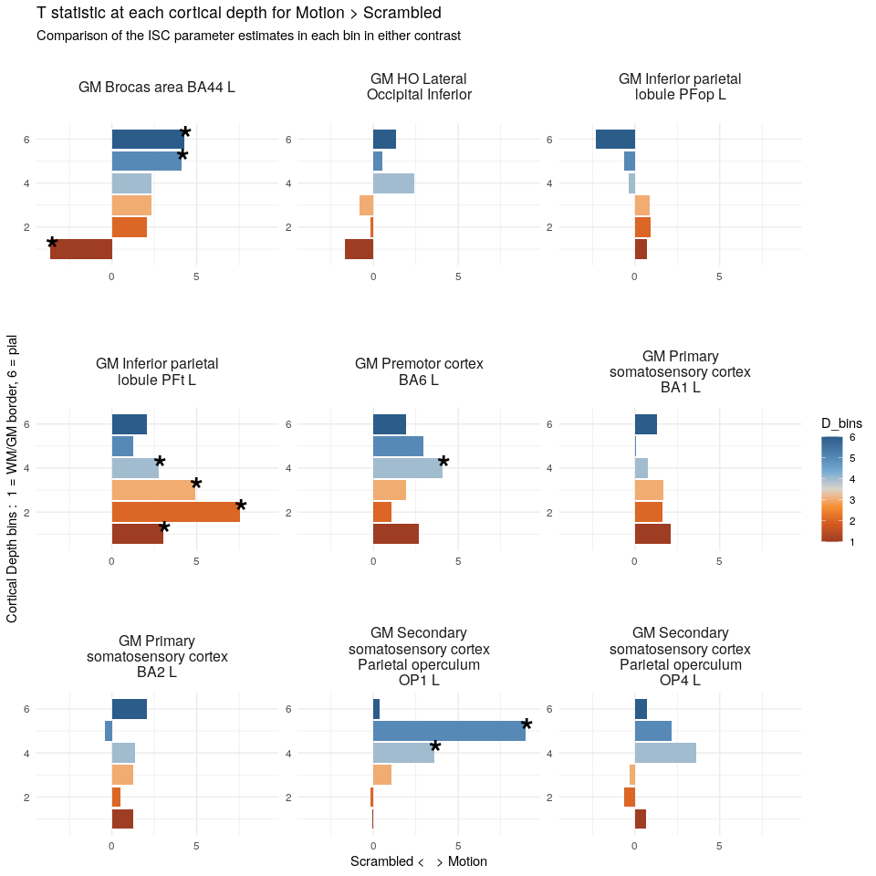
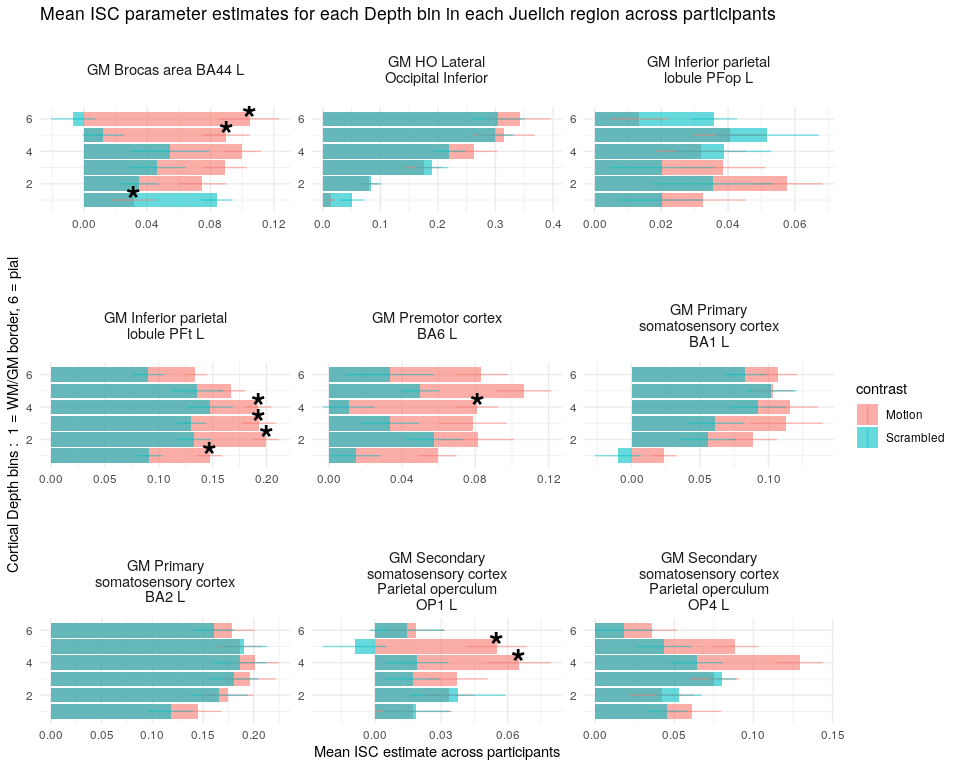
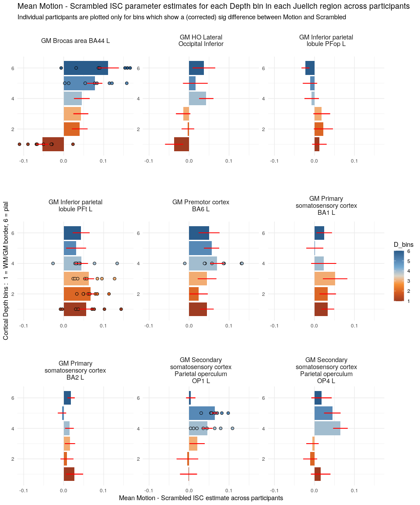

## Analytic strategy
We carried out a dual Inter-Subject Correlation (ISC) for each cortical depth bin and Juelich regions (JU ROIs) across all subjects.

**The first ISC** was carried out in the MNI space, after smoothing the data with a 6mm FWHM gaussian kernel (8 times the original voxel size). This ISC was intended to provide localizers of brain activity in either conditions. To this aim, the union of Intact ("Motion", denoted with `M`) and Scrambled (`S`) thresholded Zmaps (`M_OR_S`) was used.

Our prior hypothesis involved considering BA44, PFt and latOCC (lateral occipital). Still in the following we show the results for all the regions in the [Juelich atlas](https://www.fz-juelich.de/inm/inm-1/EN/Forschung/_docs/SPMAnatomyToolbox/SPMAnatomyToolbox_node.html) where at least 100 (native space) voxels (`clusterSizeThr` below) were significantly activated in the `M_OR_S` contrast (`N_sig` below). This assessment was carried out to confirm the specificity of our experimental hypothesis with respect to our regions of interest.


**The second ISC** took as input the average (mean) time courses extracted from the **_unsmoothed_** fmri data with the following level of granularity:

- for each cortical depth bin (user-defined `nbin` below)
- for each JU ROI (N out of ~100 JU ROIs after `clusterSizeThr`)
- for each movie (18 Motion and 18 Scrambled)
- for each run (n_run = 2)
- for each subject (n_subject = 9)

For each cortical depth bin and each JU ROI, we concatenated the segments of the BOLD time course containing movie stimuli, transformed the intensity values in Z-scores and averaged the resulting values across voxels. This resulted in a time course containing the brain activity elicited by the movies for each cortical depth bin, each region of interest and each subject.


## Read csv of ISC results and prepare the environment
The input are the ISC parameter estimates obtained for each bin of each JU region in each subject.


```r
library(dplyr)
library(tidyr)
library(purrr)
library(stringr)
library(ggplot2)
library(ggthemes)
library(kableExtra)
library(DT)
options(digits = 3)

# -------------------------- User-defined parameters --------------------------

nbin <- 6     # 3-10; check also the filenames in this dir 

# -------------------------- End of User-defined parameters -------------------


# read the table with the names of JU ROI and remove WM regions
julabels <- read.csv("labels_juelich.csv", stringsAsFactors = F) %>% 
  mutate(name = str_replace(name,"['-/]","")) %>%    # get rid of special chars
  mutate(numba = index + 1) %>%
  filter(grepl("GM", name)) %>% 
  select(-index)


results_filename <- paste0(
  getwd(), 
  "/",
  "M_OR_S_JU_time_courses_thr100_bin",
  nbin,
  "_isc.csv"
)

ISC_estimates <- read.csv(results_filename,stringsAsFactors = F)
```


## Data used to generate the plots for **6 bins**

Current binning: **6 cortical depth bins**

User-defined parameters in the cell above can be modified to display data and results related to other binning choices.


```r
# Show table with the ISC parameter estimates
ISC_estimates %>%
  select(-c(X,tc_concatenated)) %>%
  inner_join(julabels, by=c("JU"="numba")) %>%
  rename(JU_region = name) %>% 
  select(-JU) %>% 
  relocate(JU_region) %>% 
  datatable(
    extensions = 'Buttons', options = list(
    dom = 'Bfrtip',
    buttons = c('csv', 'excel')
  )
  ) %>% 
  formatRound(columns=c('isc'), digits=3)
```

<!--html_preserve--><div id="htmlwidget-a63bbdf4b29a99e96eaa" style="width:100%;height:auto;" class="datatables html-widget"></div>
<script type="application/json" data-for="htmlwidget-a63bbdf4b29a99e96eaa">{"x":{"filter":"none","extensions":["Buttons"],"data":[["1","2","3","4","5","6","7","8","9","10","11","12","13","14","15","16","17","18","19","20","21","22","23","24","25","26","27","28","29","30","31","32","33","34","35","36","37","38","39","40","41","42","43","44","45","46","47","48","49","50","51","52","53","54","55","56","57","58","59","60","61","62","63","64","65","66","67","68","69","70","71","72","73","74","75","76","77","78","79","80","81","82","83","84","85","86","87","88","89","90","91","92","93","94","95","96","97","98","99","100","101","102","103","104","105","106","107","108","109","110","111","112","113","114","115","116","117","118","119","120","121","122","123","124","125","126","127","128","129","130","131","132","133","134","135","136","137","138","139","140","141","142","143","144","145","146","147","148","149","150","151","152","153","154","155","156","157","158","159","160","161","162","163","164","165","166","167","168","169","170","171","172","173","174","175","176","177","178","179","180","181","182","183","184","185","186","187","188","189","190","191","192","193","194","195","196","197","198","199","200","201","202","203","204","205","206","207","208","209","210","211","212","213","214","215","216","217","218","219","220","221","222","223","224","225","226","227","228","229","230","231","232","233","234","235","236","237","238","239","240","241","242","243","244","245","246","247","248","249","250","251","252","253","254","255","256","257","258","259","260","261","262","263","264","265","266","267","268","269","270","271","272","273","274","275","276","277","278","279","280","281","282","283","284","285","286","287","288","289","290","291","292","293","294","295","296","297","298","299","300","301","302","303","304","305","306","307","308","309","310","311","312","313","314","315","316","317","318","319","320","321","322","323","324","325","326","327","328","329","330","331","332","333","334","335","336","337","338","339","340","341","342","343","344","345","346","347","348","349","350","351","352","353","354","355","356","357","358","359","360","361","362","363","364","365","366","367","368","369","370","371","372","373","374","375","376","377","378","379","380","381","382","383","384","385","386","387","388","389","390","391","392","393","394","395","396","397","398","399","400","401","402","403","404","405","406","407","408","409","410","411","412","413","414","415","416","417","418","419","420","421","422","423","424","425","426","427","428","429","430","431","432","433","434","435","436","437","438","439","440","441","442","443","444","445","446","447","448","449","450","451","452","453","454","455","456","457","458","459","460","461","462","463","464","465","466","467","468","469","470","471","472","473","474","475","476","477","478","479","480","481","482","483","484","485","486","487","488","489","490","491","492","493","494","495","496","497","498","499","500","501","502","503","504","505","506","507","508","509","510","511","512","513","514","515","516","517","518","519","520","521","522","523","524","525","526","527","528","529","530","531","532","533","534","535","536","537","538","539","540","541","542","543","544","545","546","547","548","549","550","551","552","553","554","555","556","557","558","559","560","561","562","563","564","565","566","567","568","569","570","571","572","573","574","575","576","577","578","579","580","581","582","583","584","585","586","587","588","589","590","591","592","593","594","595","596","597","598","599","600","601","602","603","604","605","606","607","608","609","610","611","612","613","614","615","616","617","618","619","620","621","622","623","624","625","626","627","628","629","630","631","632","633","634","635","636","637","638","639","640","641","642","643","644","645","646","647","648","649","650","651","652","653","654","655","656","657","658","659","660","661","662","663","664","665","666","667","668","669","670","671","672","673","674","675","676","677","678","679","680","681","682","683","684","685","686","687","688","689","690","691","692","693","694","695","696","697","698","699","700","701","702","703","704","705","706","707","708","709","710","711","712","713","714","715","716","717","718","719","720","721","722","723","724","725","726","727","728","729","730","731","732","733","734","735","736","737","738","739","740","741","742","743","744","745","746","747","748","749","750","751","752","753","754","755","756","757","758","759","760","761","762","763","764","765","766","767","768","769","770","771","772","773","774","775","776","777","778","779","780","781","782","783","784","785","786","787","788","789","790","791","792","793","794","795","796","797","798","799","800","801","802","803","804","805","806","807","808","809","810","811","812","813","814","815","816","817","818","819","820","821","822","823","824","825","826","827","828","829","830","831","832","833","834","835","836","837","838","839","840","841","842","843","844","845","846","847","848","849","850","851","852","853","854","855","856","857","858","859","860","861","862","863","864"],["GM_Brocas_area_BA44_L","GM_Brocas_area_BA44_L","GM_Brocas_area_BA44_L","GM_Brocas_area_BA44_L","GM_Brocas_area_BA44_L","GM_Brocas_area_BA44_L","GM_Inferior_parietal_lobule_PFop_L","GM_Inferior_parietal_lobule_PFop_L","GM_Inferior_parietal_lobule_PFop_L","GM_Inferior_parietal_lobule_PFop_L","GM_Inferior_parietal_lobule_PFop_L","GM_Inferior_parietal_lobule_PFop_L","GM_Inferior_parietal_lobule_PFt_L","GM_Inferior_parietal_lobule_PFt_L","GM_Inferior_parietal_lobule_PFt_L","GM_Inferior_parietal_lobule_PFt_L","GM_Inferior_parietal_lobule_PFt_L","GM_Inferior_parietal_lobule_PFt_L","GM_Primary_somatosensory_cortex_BA1_L","GM_Primary_somatosensory_cortex_BA1_L","GM_Primary_somatosensory_cortex_BA1_L","GM_Primary_somatosensory_cortex_BA1_L","GM_Primary_somatosensory_cortex_BA1_L","GM_Primary_somatosensory_cortex_BA1_L","GM_Primary_somatosensory_cortex_BA2_L","GM_Primary_somatosensory_cortex_BA2_L","GM_Primary_somatosensory_cortex_BA2_L","GM_Primary_somatosensory_cortex_BA2_L","GM_Primary_somatosensory_cortex_BA2_L","GM_Primary_somatosensory_cortex_BA2_L","GM_Secondary_somatosensory_cortex__Parietal_operculum_OP1_L","GM_Secondary_somatosensory_cortex__Parietal_operculum_OP1_L","GM_Secondary_somatosensory_cortex__Parietal_operculum_OP1_L","GM_Secondary_somatosensory_cortex__Parietal_operculum_OP1_L","GM_Secondary_somatosensory_cortex__Parietal_operculum_OP1_L","GM_Secondary_somatosensory_cortex__Parietal_operculum_OP1_L","GM_Secondary_somatosensory_cortex__Parietal_operculum_OP4_L","GM_Secondary_somatosensory_cortex__Parietal_operculum_OP4_L","GM_Secondary_somatosensory_cortex__Parietal_operculum_OP4_L","GM_Secondary_somatosensory_cortex__Parietal_operculum_OP4_L","GM_Secondary_somatosensory_cortex__Parietal_operculum_OP4_L","GM_Secondary_somatosensory_cortex__Parietal_operculum_OP4_L","GM_Premotor_cortex_BA6_L","GM_Premotor_cortex_BA6_L","GM_Premotor_cortex_BA6_L","GM_Premotor_cortex_BA6_L","GM_Premotor_cortex_BA6_L","GM_Premotor_cortex_BA6_L","GM_HO_Lateral_Occipital_Inferior","GM_HO_Lateral_Occipital_Inferior","GM_HO_Lateral_Occipital_Inferior","GM_HO_Lateral_Occipital_Inferior","GM_HO_Lateral_Occipital_Inferior","GM_HO_Lateral_Occipital_Inferior","GM_Brocas_area_BA44_L","GM_Brocas_area_BA44_L","GM_Brocas_area_BA44_L","GM_Brocas_area_BA44_L","GM_Brocas_area_BA44_L","GM_Brocas_area_BA44_L","GM_Inferior_parietal_lobule_PFop_L","GM_Inferior_parietal_lobule_PFop_L","GM_Inferior_parietal_lobule_PFop_L","GM_Inferior_parietal_lobule_PFop_L","GM_Inferior_parietal_lobule_PFop_L","GM_Inferior_parietal_lobule_PFop_L","GM_Inferior_parietal_lobule_PFt_L","GM_Inferior_parietal_lobule_PFt_L","GM_Inferior_parietal_lobule_PFt_L","GM_Inferior_parietal_lobule_PFt_L","GM_Inferior_parietal_lobule_PFt_L","GM_Inferior_parietal_lobule_PFt_L","GM_Primary_somatosensory_cortex_BA1_L","GM_Primary_somatosensory_cortex_BA1_L","GM_Primary_somatosensory_cortex_BA1_L","GM_Primary_somatosensory_cortex_BA1_L","GM_Primary_somatosensory_cortex_BA1_L","GM_Primary_somatosensory_cortex_BA1_L","GM_Primary_somatosensory_cortex_BA2_L","GM_Primary_somatosensory_cortex_BA2_L","GM_Primary_somatosensory_cortex_BA2_L","GM_Primary_somatosensory_cortex_BA2_L","GM_Primary_somatosensory_cortex_BA2_L","GM_Primary_somatosensory_cortex_BA2_L","GM_Secondary_somatosensory_cortex__Parietal_operculum_OP1_L","GM_Secondary_somatosensory_cortex__Parietal_operculum_OP1_L","GM_Secondary_somatosensory_cortex__Parietal_operculum_OP1_L","GM_Secondary_somatosensory_cortex__Parietal_operculum_OP1_L","GM_Secondary_somatosensory_cortex__Parietal_operculum_OP1_L","GM_Secondary_somatosensory_cortex__Parietal_operculum_OP1_L","GM_Secondary_somatosensory_cortex__Parietal_operculum_OP4_L","GM_Secondary_somatosensory_cortex__Parietal_operculum_OP4_L","GM_Secondary_somatosensory_cortex__Parietal_operculum_OP4_L","GM_Secondary_somatosensory_cortex__Parietal_operculum_OP4_L","GM_Secondary_somatosensory_cortex__Parietal_operculum_OP4_L","GM_Secondary_somatosensory_cortex__Parietal_operculum_OP4_L","GM_Premotor_cortex_BA6_L","GM_Premotor_cortex_BA6_L","GM_Premotor_cortex_BA6_L","GM_Premotor_cortex_BA6_L","GM_Premotor_cortex_BA6_L","GM_Premotor_cortex_BA6_L","GM_HO_Lateral_Occipital_Inferior","GM_HO_Lateral_Occipital_Inferior","GM_HO_Lateral_Occipital_Inferior","GM_HO_Lateral_Occipital_Inferior","GM_HO_Lateral_Occipital_Inferior","GM_HO_Lateral_Occipital_Inferior","GM_Brocas_area_BA44_L","GM_Brocas_area_BA44_L","GM_Brocas_area_BA44_L","GM_Brocas_area_BA44_L","GM_Brocas_area_BA44_L","GM_Brocas_area_BA44_L","GM_Inferior_parietal_lobule_PFop_L","GM_Inferior_parietal_lobule_PFop_L","GM_Inferior_parietal_lobule_PFop_L","GM_Inferior_parietal_lobule_PFop_L","GM_Inferior_parietal_lobule_PFop_L","GM_Inferior_parietal_lobule_PFop_L","GM_Inferior_parietal_lobule_PFt_L","GM_Inferior_parietal_lobule_PFt_L","GM_Inferior_parietal_lobule_PFt_L","GM_Inferior_parietal_lobule_PFt_L","GM_Inferior_parietal_lobule_PFt_L","GM_Inferior_parietal_lobule_PFt_L","GM_Primary_somatosensory_cortex_BA1_L","GM_Primary_somatosensory_cortex_BA1_L","GM_Primary_somatosensory_cortex_BA1_L","GM_Primary_somatosensory_cortex_BA1_L","GM_Primary_somatosensory_cortex_BA1_L","GM_Primary_somatosensory_cortex_BA1_L","GM_Primary_somatosensory_cortex_BA2_L","GM_Primary_somatosensory_cortex_BA2_L","GM_Primary_somatosensory_cortex_BA2_L","GM_Primary_somatosensory_cortex_BA2_L","GM_Primary_somatosensory_cortex_BA2_L","GM_Primary_somatosensory_cortex_BA2_L","GM_Secondary_somatosensory_cortex__Parietal_operculum_OP1_L","GM_Secondary_somatosensory_cortex__Parietal_operculum_OP1_L","GM_Secondary_somatosensory_cortex__Parietal_operculum_OP1_L","GM_Secondary_somatosensory_cortex__Parietal_operculum_OP1_L","GM_Secondary_somatosensory_cortex__Parietal_operculum_OP1_L","GM_Secondary_somatosensory_cortex__Parietal_operculum_OP1_L","GM_Secondary_somatosensory_cortex__Parietal_operculum_OP4_L","GM_Secondary_somatosensory_cortex__Parietal_operculum_OP4_L","GM_Secondary_somatosensory_cortex__Parietal_operculum_OP4_L","GM_Secondary_somatosensory_cortex__Parietal_operculum_OP4_L","GM_Secondary_somatosensory_cortex__Parietal_operculum_OP4_L","GM_Secondary_somatosensory_cortex__Parietal_operculum_OP4_L","GM_Premotor_cortex_BA6_L","GM_Premotor_cortex_BA6_L","GM_Premotor_cortex_BA6_L","GM_Premotor_cortex_BA6_L","GM_Premotor_cortex_BA6_L","GM_Premotor_cortex_BA6_L","GM_HO_Lateral_Occipital_Inferior","GM_HO_Lateral_Occipital_Inferior","GM_HO_Lateral_Occipital_Inferior","GM_HO_Lateral_Occipital_Inferior","GM_HO_Lateral_Occipital_Inferior","GM_HO_Lateral_Occipital_Inferior","GM_Brocas_area_BA44_L","GM_Brocas_area_BA44_L","GM_Brocas_area_BA44_L","GM_Brocas_area_BA44_L","GM_Brocas_area_BA44_L","GM_Brocas_area_BA44_L","GM_Inferior_parietal_lobule_PFop_L","GM_Inferior_parietal_lobule_PFop_L","GM_Inferior_parietal_lobule_PFop_L","GM_Inferior_parietal_lobule_PFop_L","GM_Inferior_parietal_lobule_PFop_L","GM_Inferior_parietal_lobule_PFop_L","GM_Inferior_parietal_lobule_PFt_L","GM_Inferior_parietal_lobule_PFt_L","GM_Inferior_parietal_lobule_PFt_L","GM_Inferior_parietal_lobule_PFt_L","GM_Inferior_parietal_lobule_PFt_L","GM_Inferior_parietal_lobule_PFt_L","GM_Primary_somatosensory_cortex_BA1_L","GM_Primary_somatosensory_cortex_BA1_L","GM_Primary_somatosensory_cortex_BA1_L","GM_Primary_somatosensory_cortex_BA1_L","GM_Primary_somatosensory_cortex_BA1_L","GM_Primary_somatosensory_cortex_BA1_L","GM_Primary_somatosensory_cortex_BA2_L","GM_Primary_somatosensory_cortex_BA2_L","GM_Primary_somatosensory_cortex_BA2_L","GM_Primary_somatosensory_cortex_BA2_L","GM_Primary_somatosensory_cortex_BA2_L","GM_Primary_somatosensory_cortex_BA2_L","GM_Secondary_somatosensory_cortex__Parietal_operculum_OP1_L","GM_Secondary_somatosensory_cortex__Parietal_operculum_OP1_L","GM_Secondary_somatosensory_cortex__Parietal_operculum_OP1_L","GM_Secondary_somatosensory_cortex__Parietal_operculum_OP1_L","GM_Secondary_somatosensory_cortex__Parietal_operculum_OP1_L","GM_Secondary_somatosensory_cortex__Parietal_operculum_OP1_L","GM_Secondary_somatosensory_cortex__Parietal_operculum_OP4_L","GM_Secondary_somatosensory_cortex__Parietal_operculum_OP4_L","GM_Secondary_somatosensory_cortex__Parietal_operculum_OP4_L","GM_Secondary_somatosensory_cortex__Parietal_operculum_OP4_L","GM_Secondary_somatosensory_cortex__Parietal_operculum_OP4_L","GM_Secondary_somatosensory_cortex__Parietal_operculum_OP4_L","GM_Premotor_cortex_BA6_L","GM_Premotor_cortex_BA6_L","GM_Premotor_cortex_BA6_L","GM_Premotor_cortex_BA6_L","GM_Premotor_cortex_BA6_L","GM_Premotor_cortex_BA6_L","GM_HO_Lateral_Occipital_Inferior","GM_HO_Lateral_Occipital_Inferior","GM_HO_Lateral_Occipital_Inferior","GM_HO_Lateral_Occipital_Inferior","GM_HO_Lateral_Occipital_Inferior","GM_HO_Lateral_Occipital_Inferior","GM_Brocas_area_BA44_L","GM_Brocas_area_BA44_L","GM_Brocas_area_BA44_L","GM_Brocas_area_BA44_L","GM_Brocas_area_BA44_L","GM_Brocas_area_BA44_L","GM_Inferior_parietal_lobule_PFop_L","GM_Inferior_parietal_lobule_PFop_L","GM_Inferior_parietal_lobule_PFop_L","GM_Inferior_parietal_lobule_PFop_L","GM_Inferior_parietal_lobule_PFop_L","GM_Inferior_parietal_lobule_PFop_L","GM_Inferior_parietal_lobule_PFt_L","GM_Inferior_parietal_lobule_PFt_L","GM_Inferior_parietal_lobule_PFt_L","GM_Inferior_parietal_lobule_PFt_L","GM_Inferior_parietal_lobule_PFt_L","GM_Inferior_parietal_lobule_PFt_L","GM_Primary_somatosensory_cortex_BA1_L","GM_Primary_somatosensory_cortex_BA1_L","GM_Primary_somatosensory_cortex_BA1_L","GM_Primary_somatosensory_cortex_BA1_L","GM_Primary_somatosensory_cortex_BA1_L","GM_Primary_somatosensory_cortex_BA1_L","GM_Primary_somatosensory_cortex_BA2_L","GM_Primary_somatosensory_cortex_BA2_L","GM_Primary_somatosensory_cortex_BA2_L","GM_Primary_somatosensory_cortex_BA2_L","GM_Primary_somatosensory_cortex_BA2_L","GM_Primary_somatosensory_cortex_BA2_L","GM_Secondary_somatosensory_cortex__Parietal_operculum_OP1_L","GM_Secondary_somatosensory_cortex__Parietal_operculum_OP1_L","GM_Secondary_somatosensory_cortex__Parietal_operculum_OP1_L","GM_Secondary_somatosensory_cortex__Parietal_operculum_OP1_L","GM_Secondary_somatosensory_cortex__Parietal_operculum_OP1_L","GM_Secondary_somatosensory_cortex__Parietal_operculum_OP1_L","GM_Secondary_somatosensory_cortex__Parietal_operculum_OP4_L","GM_Secondary_somatosensory_cortex__Parietal_operculum_OP4_L","GM_Secondary_somatosensory_cortex__Parietal_operculum_OP4_L","GM_Secondary_somatosensory_cortex__Parietal_operculum_OP4_L","GM_Secondary_somatosensory_cortex__Parietal_operculum_OP4_L","GM_Secondary_somatosensory_cortex__Parietal_operculum_OP4_L","GM_Premotor_cortex_BA6_L","GM_Premotor_cortex_BA6_L","GM_Premotor_cortex_BA6_L","GM_Premotor_cortex_BA6_L","GM_Premotor_cortex_BA6_L","GM_Premotor_cortex_BA6_L","GM_HO_Lateral_Occipital_Inferior","GM_HO_Lateral_Occipital_Inferior","GM_HO_Lateral_Occipital_Inferior","GM_HO_Lateral_Occipital_Inferior","GM_HO_Lateral_Occipital_Inferior","GM_HO_Lateral_Occipital_Inferior","GM_Brocas_area_BA44_L","GM_Brocas_area_BA44_L","GM_Brocas_area_BA44_L","GM_Brocas_area_BA44_L","GM_Brocas_area_BA44_L","GM_Brocas_area_BA44_L","GM_Inferior_parietal_lobule_PFop_L","GM_Inferior_parietal_lobule_PFop_L","GM_Inferior_parietal_lobule_PFop_L","GM_Inferior_parietal_lobule_PFop_L","GM_Inferior_parietal_lobule_PFop_L","GM_Inferior_parietal_lobule_PFop_L","GM_Inferior_parietal_lobule_PFt_L","GM_Inferior_parietal_lobule_PFt_L","GM_Inferior_parietal_lobule_PFt_L","GM_Inferior_parietal_lobule_PFt_L","GM_Inferior_parietal_lobule_PFt_L","GM_Inferior_parietal_lobule_PFt_L","GM_Primary_somatosensory_cortex_BA1_L","GM_Primary_somatosensory_cortex_BA1_L","GM_Primary_somatosensory_cortex_BA1_L","GM_Primary_somatosensory_cortex_BA1_L","GM_Primary_somatosensory_cortex_BA1_L","GM_Primary_somatosensory_cortex_BA1_L","GM_Primary_somatosensory_cortex_BA2_L","GM_Primary_somatosensory_cortex_BA2_L","GM_Primary_somatosensory_cortex_BA2_L","GM_Primary_somatosensory_cortex_BA2_L","GM_Primary_somatosensory_cortex_BA2_L","GM_Primary_somatosensory_cortex_BA2_L","GM_Secondary_somatosensory_cortex__Parietal_operculum_OP1_L","GM_Secondary_somatosensory_cortex__Parietal_operculum_OP1_L","GM_Secondary_somatosensory_cortex__Parietal_operculum_OP1_L","GM_Secondary_somatosensory_cortex__Parietal_operculum_OP1_L","GM_Secondary_somatosensory_cortex__Parietal_operculum_OP1_L","GM_Secondary_somatosensory_cortex__Parietal_operculum_OP1_L","GM_Secondary_somatosensory_cortex__Parietal_operculum_OP4_L","GM_Secondary_somatosensory_cortex__Parietal_operculum_OP4_L","GM_Secondary_somatosensory_cortex__Parietal_operculum_OP4_L","GM_Secondary_somatosensory_cortex__Parietal_operculum_OP4_L","GM_Secondary_somatosensory_cortex__Parietal_operculum_OP4_L","GM_Secondary_somatosensory_cortex__Parietal_operculum_OP4_L","GM_Premotor_cortex_BA6_L","GM_Premotor_cortex_BA6_L","GM_Premotor_cortex_BA6_L","GM_Premotor_cortex_BA6_L","GM_Premotor_cortex_BA6_L","GM_Premotor_cortex_BA6_L","GM_HO_Lateral_Occipital_Inferior","GM_HO_Lateral_Occipital_Inferior","GM_HO_Lateral_Occipital_Inferior","GM_HO_Lateral_Occipital_Inferior","GM_HO_Lateral_Occipital_Inferior","GM_HO_Lateral_Occipital_Inferior","GM_Brocas_area_BA44_L","GM_Brocas_area_BA44_L","GM_Brocas_area_BA44_L","GM_Brocas_area_BA44_L","GM_Brocas_area_BA44_L","GM_Brocas_area_BA44_L","GM_Inferior_parietal_lobule_PFop_L","GM_Inferior_parietal_lobule_PFop_L","GM_Inferior_parietal_lobule_PFop_L","GM_Inferior_parietal_lobule_PFop_L","GM_Inferior_parietal_lobule_PFop_L","GM_Inferior_parietal_lobule_PFop_L","GM_Inferior_parietal_lobule_PFt_L","GM_Inferior_parietal_lobule_PFt_L","GM_Inferior_parietal_lobule_PFt_L","GM_Inferior_parietal_lobule_PFt_L","GM_Inferior_parietal_lobule_PFt_L","GM_Inferior_parietal_lobule_PFt_L","GM_Primary_somatosensory_cortex_BA1_L","GM_Primary_somatosensory_cortex_BA1_L","GM_Primary_somatosensory_cortex_BA1_L","GM_Primary_somatosensory_cortex_BA1_L","GM_Primary_somatosensory_cortex_BA1_L","GM_Primary_somatosensory_cortex_BA1_L","GM_Primary_somatosensory_cortex_BA2_L","GM_Primary_somatosensory_cortex_BA2_L","GM_Primary_somatosensory_cortex_BA2_L","GM_Primary_somatosensory_cortex_BA2_L","GM_Primary_somatosensory_cortex_BA2_L","GM_Primary_somatosensory_cortex_BA2_L","GM_Secondary_somatosensory_cortex__Parietal_operculum_OP1_L","GM_Secondary_somatosensory_cortex__Parietal_operculum_OP1_L","GM_Secondary_somatosensory_cortex__Parietal_operculum_OP1_L","GM_Secondary_somatosensory_cortex__Parietal_operculum_OP1_L","GM_Secondary_somatosensory_cortex__Parietal_operculum_OP1_L","GM_Secondary_somatosensory_cortex__Parietal_operculum_OP1_L","GM_Secondary_somatosensory_cortex__Parietal_operculum_OP4_L","GM_Secondary_somatosensory_cortex__Parietal_operculum_OP4_L","GM_Secondary_somatosensory_cortex__Parietal_operculum_OP4_L","GM_Secondary_somatosensory_cortex__Parietal_operculum_OP4_L","GM_Secondary_somatosensory_cortex__Parietal_operculum_OP4_L","GM_Secondary_somatosensory_cortex__Parietal_operculum_OP4_L","GM_Premotor_cortex_BA6_L","GM_Premotor_cortex_BA6_L","GM_Premotor_cortex_BA6_L","GM_Premotor_cortex_BA6_L","GM_Premotor_cortex_BA6_L","GM_Premotor_cortex_BA6_L","GM_HO_Lateral_Occipital_Inferior","GM_HO_Lateral_Occipital_Inferior","GM_HO_Lateral_Occipital_Inferior","GM_HO_Lateral_Occipital_Inferior","GM_HO_Lateral_Occipital_Inferior","GM_HO_Lateral_Occipital_Inferior","GM_Brocas_area_BA44_L","GM_Brocas_area_BA44_L","GM_Brocas_area_BA44_L","GM_Brocas_area_BA44_L","GM_Brocas_area_BA44_L","GM_Brocas_area_BA44_L","GM_Inferior_parietal_lobule_PFop_L","GM_Inferior_parietal_lobule_PFop_L","GM_Inferior_parietal_lobule_PFop_L","GM_Inferior_parietal_lobule_PFop_L","GM_Inferior_parietal_lobule_PFop_L","GM_Inferior_parietal_lobule_PFop_L","GM_Inferior_parietal_lobule_PFt_L","GM_Inferior_parietal_lobule_PFt_L","GM_Inferior_parietal_lobule_PFt_L","GM_Inferior_parietal_lobule_PFt_L","GM_Inferior_parietal_lobule_PFt_L","GM_Inferior_parietal_lobule_PFt_L","GM_Primary_somatosensory_cortex_BA1_L","GM_Primary_somatosensory_cortex_BA1_L","GM_Primary_somatosensory_cortex_BA1_L","GM_Primary_somatosensory_cortex_BA1_L","GM_Primary_somatosensory_cortex_BA1_L","GM_Primary_somatosensory_cortex_BA1_L","GM_Primary_somatosensory_cortex_BA2_L","GM_Primary_somatosensory_cortex_BA2_L","GM_Primary_somatosensory_cortex_BA2_L","GM_Primary_somatosensory_cortex_BA2_L","GM_Primary_somatosensory_cortex_BA2_L","GM_Primary_somatosensory_cortex_BA2_L","GM_Secondary_somatosensory_cortex__Parietal_operculum_OP1_L","GM_Secondary_somatosensory_cortex__Parietal_operculum_OP1_L","GM_Secondary_somatosensory_cortex__Parietal_operculum_OP1_L","GM_Secondary_somatosensory_cortex__Parietal_operculum_OP1_L","GM_Secondary_somatosensory_cortex__Parietal_operculum_OP1_L","GM_Secondary_somatosensory_cortex__Parietal_operculum_OP1_L","GM_Secondary_somatosensory_cortex__Parietal_operculum_OP4_L","GM_Secondary_somatosensory_cortex__Parietal_operculum_OP4_L","GM_Secondary_somatosensory_cortex__Parietal_operculum_OP4_L","GM_Secondary_somatosensory_cortex__Parietal_operculum_OP4_L","GM_Secondary_somatosensory_cortex__Parietal_operculum_OP4_L","GM_Secondary_somatosensory_cortex__Parietal_operculum_OP4_L","GM_Premotor_cortex_BA6_L","GM_Premotor_cortex_BA6_L","GM_Premotor_cortex_BA6_L","GM_Premotor_cortex_BA6_L","GM_Premotor_cortex_BA6_L","GM_Premotor_cortex_BA6_L","GM_HO_Lateral_Occipital_Inferior","GM_HO_Lateral_Occipital_Inferior","GM_HO_Lateral_Occipital_Inferior","GM_HO_Lateral_Occipital_Inferior","GM_HO_Lateral_Occipital_Inferior","GM_HO_Lateral_Occipital_Inferior","GM_Brocas_area_BA44_L","GM_Brocas_area_BA44_L","GM_Brocas_area_BA44_L","GM_Brocas_area_BA44_L","GM_Brocas_area_BA44_L","GM_Brocas_area_BA44_L","GM_Inferior_parietal_lobule_PFop_L","GM_Inferior_parietal_lobule_PFop_L","GM_Inferior_parietal_lobule_PFop_L","GM_Inferior_parietal_lobule_PFop_L","GM_Inferior_parietal_lobule_PFop_L","GM_Inferior_parietal_lobule_PFop_L","GM_Inferior_parietal_lobule_PFt_L","GM_Inferior_parietal_lobule_PFt_L","GM_Inferior_parietal_lobule_PFt_L","GM_Inferior_parietal_lobule_PFt_L","GM_Inferior_parietal_lobule_PFt_L","GM_Inferior_parietal_lobule_PFt_L","GM_Primary_somatosensory_cortex_BA1_L","GM_Primary_somatosensory_cortex_BA1_L","GM_Primary_somatosensory_cortex_BA1_L","GM_Primary_somatosensory_cortex_BA1_L","GM_Primary_somatosensory_cortex_BA1_L","GM_Primary_somatosensory_cortex_BA1_L","GM_Primary_somatosensory_cortex_BA2_L","GM_Primary_somatosensory_cortex_BA2_L","GM_Primary_somatosensory_cortex_BA2_L","GM_Primary_somatosensory_cortex_BA2_L","GM_Primary_somatosensory_cortex_BA2_L","GM_Primary_somatosensory_cortex_BA2_L","GM_Secondary_somatosensory_cortex__Parietal_operculum_OP1_L","GM_Secondary_somatosensory_cortex__Parietal_operculum_OP1_L","GM_Secondary_somatosensory_cortex__Parietal_operculum_OP1_L","GM_Secondary_somatosensory_cortex__Parietal_operculum_OP1_L","GM_Secondary_somatosensory_cortex__Parietal_operculum_OP1_L","GM_Secondary_somatosensory_cortex__Parietal_operculum_OP1_L","GM_Secondary_somatosensory_cortex__Parietal_operculum_OP4_L","GM_Secondary_somatosensory_cortex__Parietal_operculum_OP4_L","GM_Secondary_somatosensory_cortex__Parietal_operculum_OP4_L","GM_Secondary_somatosensory_cortex__Parietal_operculum_OP4_L","GM_Secondary_somatosensory_cortex__Parietal_operculum_OP4_L","GM_Secondary_somatosensory_cortex__Parietal_operculum_OP4_L","GM_Premotor_cortex_BA6_L","GM_Premotor_cortex_BA6_L","GM_Premotor_cortex_BA6_L","GM_Premotor_cortex_BA6_L","GM_Premotor_cortex_BA6_L","GM_Premotor_cortex_BA6_L","GM_HO_Lateral_Occipital_Inferior","GM_HO_Lateral_Occipital_Inferior","GM_HO_Lateral_Occipital_Inferior","GM_HO_Lateral_Occipital_Inferior","GM_HO_Lateral_Occipital_Inferior","GM_HO_Lateral_Occipital_Inferior","GM_Brocas_area_BA44_L","GM_Brocas_area_BA44_L","GM_Brocas_area_BA44_L","GM_Brocas_area_BA44_L","GM_Brocas_area_BA44_L","GM_Brocas_area_BA44_L","GM_Inferior_parietal_lobule_PFop_L","GM_Inferior_parietal_lobule_PFop_L","GM_Inferior_parietal_lobule_PFop_L","GM_Inferior_parietal_lobule_PFop_L","GM_Inferior_parietal_lobule_PFop_L","GM_Inferior_parietal_lobule_PFop_L","GM_Inferior_parietal_lobule_PFt_L","GM_Inferior_parietal_lobule_PFt_L","GM_Inferior_parietal_lobule_PFt_L","GM_Inferior_parietal_lobule_PFt_L","GM_Inferior_parietal_lobule_PFt_L","GM_Inferior_parietal_lobule_PFt_L","GM_Primary_somatosensory_cortex_BA1_L","GM_Primary_somatosensory_cortex_BA1_L","GM_Primary_somatosensory_cortex_BA1_L","GM_Primary_somatosensory_cortex_BA1_L","GM_Primary_somatosensory_cortex_BA1_L","GM_Primary_somatosensory_cortex_BA1_L","GM_Primary_somatosensory_cortex_BA2_L","GM_Primary_somatosensory_cortex_BA2_L","GM_Primary_somatosensory_cortex_BA2_L","GM_Primary_somatosensory_cortex_BA2_L","GM_Primary_somatosensory_cortex_BA2_L","GM_Primary_somatosensory_cortex_BA2_L","GM_Secondary_somatosensory_cortex__Parietal_operculum_OP1_L","GM_Secondary_somatosensory_cortex__Parietal_operculum_OP1_L","GM_Secondary_somatosensory_cortex__Parietal_operculum_OP1_L","GM_Secondary_somatosensory_cortex__Parietal_operculum_OP1_L","GM_Secondary_somatosensory_cortex__Parietal_operculum_OP1_L","GM_Secondary_somatosensory_cortex__Parietal_operculum_OP1_L","GM_Secondary_somatosensory_cortex__Parietal_operculum_OP4_L","GM_Secondary_somatosensory_cortex__Parietal_operculum_OP4_L","GM_Secondary_somatosensory_cortex__Parietal_operculum_OP4_L","GM_Secondary_somatosensory_cortex__Parietal_operculum_OP4_L","GM_Secondary_somatosensory_cortex__Parietal_operculum_OP4_L","GM_Secondary_somatosensory_cortex__Parietal_operculum_OP4_L","GM_Premotor_cortex_BA6_L","GM_Premotor_cortex_BA6_L","GM_Premotor_cortex_BA6_L","GM_Premotor_cortex_BA6_L","GM_Premotor_cortex_BA6_L","GM_Premotor_cortex_BA6_L","GM_HO_Lateral_Occipital_Inferior","GM_HO_Lateral_Occipital_Inferior","GM_HO_Lateral_Occipital_Inferior","GM_HO_Lateral_Occipital_Inferior","GM_HO_Lateral_Occipital_Inferior","GM_HO_Lateral_Occipital_Inferior","GM_Brocas_area_BA44_L","GM_Brocas_area_BA44_L","GM_Brocas_area_BA44_L","GM_Brocas_area_BA44_L","GM_Brocas_area_BA44_L","GM_Brocas_area_BA44_L","GM_Inferior_parietal_lobule_PFop_L","GM_Inferior_parietal_lobule_PFop_L","GM_Inferior_parietal_lobule_PFop_L","GM_Inferior_parietal_lobule_PFop_L","GM_Inferior_parietal_lobule_PFop_L","GM_Inferior_parietal_lobule_PFop_L","GM_Inferior_parietal_lobule_PFt_L","GM_Inferior_parietal_lobule_PFt_L","GM_Inferior_parietal_lobule_PFt_L","GM_Inferior_parietal_lobule_PFt_L","GM_Inferior_parietal_lobule_PFt_L","GM_Inferior_parietal_lobule_PFt_L","GM_Primary_somatosensory_cortex_BA1_L","GM_Primary_somatosensory_cortex_BA1_L","GM_Primary_somatosensory_cortex_BA1_L","GM_Primary_somatosensory_cortex_BA1_L","GM_Primary_somatosensory_cortex_BA1_L","GM_Primary_somatosensory_cortex_BA1_L","GM_Primary_somatosensory_cortex_BA2_L","GM_Primary_somatosensory_cortex_BA2_L","GM_Primary_somatosensory_cortex_BA2_L","GM_Primary_somatosensory_cortex_BA2_L","GM_Primary_somatosensory_cortex_BA2_L","GM_Primary_somatosensory_cortex_BA2_L","GM_Secondary_somatosensory_cortex__Parietal_operculum_OP1_L","GM_Secondary_somatosensory_cortex__Parietal_operculum_OP1_L","GM_Secondary_somatosensory_cortex__Parietal_operculum_OP1_L","GM_Secondary_somatosensory_cortex__Parietal_operculum_OP1_L","GM_Secondary_somatosensory_cortex__Parietal_operculum_OP1_L","GM_Secondary_somatosensory_cortex__Parietal_operculum_OP1_L","GM_Secondary_somatosensory_cortex__Parietal_operculum_OP4_L","GM_Secondary_somatosensory_cortex__Parietal_operculum_OP4_L","GM_Secondary_somatosensory_cortex__Parietal_operculum_OP4_L","GM_Secondary_somatosensory_cortex__Parietal_operculum_OP4_L","GM_Secondary_somatosensory_cortex__Parietal_operculum_OP4_L","GM_Secondary_somatosensory_cortex__Parietal_operculum_OP4_L","GM_Premotor_cortex_BA6_L","GM_Premotor_cortex_BA6_L","GM_Premotor_cortex_BA6_L","GM_Premotor_cortex_BA6_L","GM_Premotor_cortex_BA6_L","GM_Premotor_cortex_BA6_L","GM_HO_Lateral_Occipital_Inferior","GM_HO_Lateral_Occipital_Inferior","GM_HO_Lateral_Occipital_Inferior","GM_HO_Lateral_Occipital_Inferior","GM_HO_Lateral_Occipital_Inferior","GM_HO_Lateral_Occipital_Inferior","GM_Brocas_area_BA44_L","GM_Brocas_area_BA44_L","GM_Brocas_area_BA44_L","GM_Brocas_area_BA44_L","GM_Brocas_area_BA44_L","GM_Brocas_area_BA44_L","GM_Inferior_parietal_lobule_PFop_L","GM_Inferior_parietal_lobule_PFop_L","GM_Inferior_parietal_lobule_PFop_L","GM_Inferior_parietal_lobule_PFop_L","GM_Inferior_parietal_lobule_PFop_L","GM_Inferior_parietal_lobule_PFop_L","GM_Inferior_parietal_lobule_PFt_L","GM_Inferior_parietal_lobule_PFt_L","GM_Inferior_parietal_lobule_PFt_L","GM_Inferior_parietal_lobule_PFt_L","GM_Inferior_parietal_lobule_PFt_L","GM_Inferior_parietal_lobule_PFt_L","GM_Primary_somatosensory_cortex_BA1_L","GM_Primary_somatosensory_cortex_BA1_L","GM_Primary_somatosensory_cortex_BA1_L","GM_Primary_somatosensory_cortex_BA1_L","GM_Primary_somatosensory_cortex_BA1_L","GM_Primary_somatosensory_cortex_BA1_L","GM_Primary_somatosensory_cortex_BA2_L","GM_Primary_somatosensory_cortex_BA2_L","GM_Primary_somatosensory_cortex_BA2_L","GM_Primary_somatosensory_cortex_BA2_L","GM_Primary_somatosensory_cortex_BA2_L","GM_Primary_somatosensory_cortex_BA2_L","GM_Secondary_somatosensory_cortex__Parietal_operculum_OP1_L","GM_Secondary_somatosensory_cortex__Parietal_operculum_OP1_L","GM_Secondary_somatosensory_cortex__Parietal_operculum_OP1_L","GM_Secondary_somatosensory_cortex__Parietal_operculum_OP1_L","GM_Secondary_somatosensory_cortex__Parietal_operculum_OP1_L","GM_Secondary_somatosensory_cortex__Parietal_operculum_OP1_L","GM_Secondary_somatosensory_cortex__Parietal_operculum_OP4_L","GM_Secondary_somatosensory_cortex__Parietal_operculum_OP4_L","GM_Secondary_somatosensory_cortex__Parietal_operculum_OP4_L","GM_Secondary_somatosensory_cortex__Parietal_operculum_OP4_L","GM_Secondary_somatosensory_cortex__Parietal_operculum_OP4_L","GM_Secondary_somatosensory_cortex__Parietal_operculum_OP4_L","GM_Premotor_cortex_BA6_L","GM_Premotor_cortex_BA6_L","GM_Premotor_cortex_BA6_L","GM_Premotor_cortex_BA6_L","GM_Premotor_cortex_BA6_L","GM_Premotor_cortex_BA6_L","GM_HO_Lateral_Occipital_Inferior","GM_HO_Lateral_Occipital_Inferior","GM_HO_Lateral_Occipital_Inferior","GM_HO_Lateral_Occipital_Inferior","GM_HO_Lateral_Occipital_Inferior","GM_HO_Lateral_Occipital_Inferior","GM_Brocas_area_BA44_L","GM_Brocas_area_BA44_L","GM_Brocas_area_BA44_L","GM_Brocas_area_BA44_L","GM_Brocas_area_BA44_L","GM_Brocas_area_BA44_L","GM_Inferior_parietal_lobule_PFop_L","GM_Inferior_parietal_lobule_PFop_L","GM_Inferior_parietal_lobule_PFop_L","GM_Inferior_parietal_lobule_PFop_L","GM_Inferior_parietal_lobule_PFop_L","GM_Inferior_parietal_lobule_PFop_L","GM_Inferior_parietal_lobule_PFt_L","GM_Inferior_parietal_lobule_PFt_L","GM_Inferior_parietal_lobule_PFt_L","GM_Inferior_parietal_lobule_PFt_L","GM_Inferior_parietal_lobule_PFt_L","GM_Inferior_parietal_lobule_PFt_L","GM_Primary_somatosensory_cortex_BA1_L","GM_Primary_somatosensory_cortex_BA1_L","GM_Primary_somatosensory_cortex_BA1_L","GM_Primary_somatosensory_cortex_BA1_L","GM_Primary_somatosensory_cortex_BA1_L","GM_Primary_somatosensory_cortex_BA1_L","GM_Primary_somatosensory_cortex_BA2_L","GM_Primary_somatosensory_cortex_BA2_L","GM_Primary_somatosensory_cortex_BA2_L","GM_Primary_somatosensory_cortex_BA2_L","GM_Primary_somatosensory_cortex_BA2_L","GM_Primary_somatosensory_cortex_BA2_L","GM_Secondary_somatosensory_cortex__Parietal_operculum_OP1_L","GM_Secondary_somatosensory_cortex__Parietal_operculum_OP1_L","GM_Secondary_somatosensory_cortex__Parietal_operculum_OP1_L","GM_Secondary_somatosensory_cortex__Parietal_operculum_OP1_L","GM_Secondary_somatosensory_cortex__Parietal_operculum_OP1_L","GM_Secondary_somatosensory_cortex__Parietal_operculum_OP1_L","GM_Secondary_somatosensory_cortex__Parietal_operculum_OP4_L","GM_Secondary_somatosensory_cortex__Parietal_operculum_OP4_L","GM_Secondary_somatosensory_cortex__Parietal_operculum_OP4_L","GM_Secondary_somatosensory_cortex__Parietal_operculum_OP4_L","GM_Secondary_somatosensory_cortex__Parietal_operculum_OP4_L","GM_Secondary_somatosensory_cortex__Parietal_operculum_OP4_L","GM_Premotor_cortex_BA6_L","GM_Premotor_cortex_BA6_L","GM_Premotor_cortex_BA6_L","GM_Premotor_cortex_BA6_L","GM_Premotor_cortex_BA6_L","GM_Premotor_cortex_BA6_L","GM_HO_Lateral_Occipital_Inferior","GM_HO_Lateral_Occipital_Inferior","GM_HO_Lateral_Occipital_Inferior","GM_HO_Lateral_Occipital_Inferior","GM_HO_Lateral_Occipital_Inferior","GM_HO_Lateral_Occipital_Inferior","GM_Brocas_area_BA44_L","GM_Brocas_area_BA44_L","GM_Brocas_area_BA44_L","GM_Brocas_area_BA44_L","GM_Brocas_area_BA44_L","GM_Brocas_area_BA44_L","GM_Inferior_parietal_lobule_PFop_L","GM_Inferior_parietal_lobule_PFop_L","GM_Inferior_parietal_lobule_PFop_L","GM_Inferior_parietal_lobule_PFop_L","GM_Inferior_parietal_lobule_PFop_L","GM_Inferior_parietal_lobule_PFop_L","GM_Inferior_parietal_lobule_PFt_L","GM_Inferior_parietal_lobule_PFt_L","GM_Inferior_parietal_lobule_PFt_L","GM_Inferior_parietal_lobule_PFt_L","GM_Inferior_parietal_lobule_PFt_L","GM_Inferior_parietal_lobule_PFt_L","GM_Primary_somatosensory_cortex_BA1_L","GM_Primary_somatosensory_cortex_BA1_L","GM_Primary_somatosensory_cortex_BA1_L","GM_Primary_somatosensory_cortex_BA1_L","GM_Primary_somatosensory_cortex_BA1_L","GM_Primary_somatosensory_cortex_BA1_L","GM_Primary_somatosensory_cortex_BA2_L","GM_Primary_somatosensory_cortex_BA2_L","GM_Primary_somatosensory_cortex_BA2_L","GM_Primary_somatosensory_cortex_BA2_L","GM_Primary_somatosensory_cortex_BA2_L","GM_Primary_somatosensory_cortex_BA2_L","GM_Secondary_somatosensory_cortex__Parietal_operculum_OP1_L","GM_Secondary_somatosensory_cortex__Parietal_operculum_OP1_L","GM_Secondary_somatosensory_cortex__Parietal_operculum_OP1_L","GM_Secondary_somatosensory_cortex__Parietal_operculum_OP1_L","GM_Secondary_somatosensory_cortex__Parietal_operculum_OP1_L","GM_Secondary_somatosensory_cortex__Parietal_operculum_OP1_L","GM_Secondary_somatosensory_cortex__Parietal_operculum_OP4_L","GM_Secondary_somatosensory_cortex__Parietal_operculum_OP4_L","GM_Secondary_somatosensory_cortex__Parietal_operculum_OP4_L","GM_Secondary_somatosensory_cortex__Parietal_operculum_OP4_L","GM_Secondary_somatosensory_cortex__Parietal_operculum_OP4_L","GM_Secondary_somatosensory_cortex__Parietal_operculum_OP4_L","GM_Premotor_cortex_BA6_L","GM_Premotor_cortex_BA6_L","GM_Premotor_cortex_BA6_L","GM_Premotor_cortex_BA6_L","GM_Premotor_cortex_BA6_L","GM_Premotor_cortex_BA6_L","GM_HO_Lateral_Occipital_Inferior","GM_HO_Lateral_Occipital_Inferior","GM_HO_Lateral_Occipital_Inferior","GM_HO_Lateral_Occipital_Inferior","GM_HO_Lateral_Occipital_Inferior","GM_HO_Lateral_Occipital_Inferior","GM_Brocas_area_BA44_L","GM_Brocas_area_BA44_L","GM_Brocas_area_BA44_L","GM_Brocas_area_BA44_L","GM_Brocas_area_BA44_L","GM_Brocas_area_BA44_L","GM_Inferior_parietal_lobule_PFop_L","GM_Inferior_parietal_lobule_PFop_L","GM_Inferior_parietal_lobule_PFop_L","GM_Inferior_parietal_lobule_PFop_L","GM_Inferior_parietal_lobule_PFop_L","GM_Inferior_parietal_lobule_PFop_L","GM_Inferior_parietal_lobule_PFt_L","GM_Inferior_parietal_lobule_PFt_L","GM_Inferior_parietal_lobule_PFt_L","GM_Inferior_parietal_lobule_PFt_L","GM_Inferior_parietal_lobule_PFt_L","GM_Inferior_parietal_lobule_PFt_L","GM_Primary_somatosensory_cortex_BA1_L","GM_Primary_somatosensory_cortex_BA1_L","GM_Primary_somatosensory_cortex_BA1_L","GM_Primary_somatosensory_cortex_BA1_L","GM_Primary_somatosensory_cortex_BA1_L","GM_Primary_somatosensory_cortex_BA1_L","GM_Primary_somatosensory_cortex_BA2_L","GM_Primary_somatosensory_cortex_BA2_L","GM_Primary_somatosensory_cortex_BA2_L","GM_Primary_somatosensory_cortex_BA2_L","GM_Primary_somatosensory_cortex_BA2_L","GM_Primary_somatosensory_cortex_BA2_L","GM_Secondary_somatosensory_cortex__Parietal_operculum_OP1_L","GM_Secondary_somatosensory_cortex__Parietal_operculum_OP1_L","GM_Secondary_somatosensory_cortex__Parietal_operculum_OP1_L","GM_Secondary_somatosensory_cortex__Parietal_operculum_OP1_L","GM_Secondary_somatosensory_cortex__Parietal_operculum_OP1_L","GM_Secondary_somatosensory_cortex__Parietal_operculum_OP1_L","GM_Secondary_somatosensory_cortex__Parietal_operculum_OP4_L","GM_Secondary_somatosensory_cortex__Parietal_operculum_OP4_L","GM_Secondary_somatosensory_cortex__Parietal_operculum_OP4_L","GM_Secondary_somatosensory_cortex__Parietal_operculum_OP4_L","GM_Secondary_somatosensory_cortex__Parietal_operculum_OP4_L","GM_Secondary_somatosensory_cortex__Parietal_operculum_OP4_L","GM_Premotor_cortex_BA6_L","GM_Premotor_cortex_BA6_L","GM_Premotor_cortex_BA6_L","GM_Premotor_cortex_BA6_L","GM_Premotor_cortex_BA6_L","GM_Premotor_cortex_BA6_L","GM_HO_Lateral_Occipital_Inferior","GM_HO_Lateral_Occipital_Inferior","GM_HO_Lateral_Occipital_Inferior","GM_HO_Lateral_Occipital_Inferior","GM_HO_Lateral_Occipital_Inferior","GM_HO_Lateral_Occipital_Inferior","GM_Brocas_area_BA44_L","GM_Brocas_area_BA44_L","GM_Brocas_area_BA44_L","GM_Brocas_area_BA44_L","GM_Brocas_area_BA44_L","GM_Brocas_area_BA44_L","GM_Inferior_parietal_lobule_PFop_L","GM_Inferior_parietal_lobule_PFop_L","GM_Inferior_parietal_lobule_PFop_L","GM_Inferior_parietal_lobule_PFop_L","GM_Inferior_parietal_lobule_PFop_L","GM_Inferior_parietal_lobule_PFop_L","GM_Inferior_parietal_lobule_PFt_L","GM_Inferior_parietal_lobule_PFt_L","GM_Inferior_parietal_lobule_PFt_L","GM_Inferior_parietal_lobule_PFt_L","GM_Inferior_parietal_lobule_PFt_L","GM_Inferior_parietal_lobule_PFt_L","GM_Primary_somatosensory_cortex_BA1_L","GM_Primary_somatosensory_cortex_BA1_L","GM_Primary_somatosensory_cortex_BA1_L","GM_Primary_somatosensory_cortex_BA1_L","GM_Primary_somatosensory_cortex_BA1_L","GM_Primary_somatosensory_cortex_BA1_L","GM_Primary_somatosensory_cortex_BA2_L","GM_Primary_somatosensory_cortex_BA2_L","GM_Primary_somatosensory_cortex_BA2_L","GM_Primary_somatosensory_cortex_BA2_L","GM_Primary_somatosensory_cortex_BA2_L","GM_Primary_somatosensory_cortex_BA2_L","GM_Secondary_somatosensory_cortex__Parietal_operculum_OP1_L","GM_Secondary_somatosensory_cortex__Parietal_operculum_OP1_L","GM_Secondary_somatosensory_cortex__Parietal_operculum_OP1_L","GM_Secondary_somatosensory_cortex__Parietal_operculum_OP1_L","GM_Secondary_somatosensory_cortex__Parietal_operculum_OP1_L","GM_Secondary_somatosensory_cortex__Parietal_operculum_OP1_L","GM_Secondary_somatosensory_cortex__Parietal_operculum_OP4_L","GM_Secondary_somatosensory_cortex__Parietal_operculum_OP4_L","GM_Secondary_somatosensory_cortex__Parietal_operculum_OP4_L","GM_Secondary_somatosensory_cortex__Parietal_operculum_OP4_L","GM_Secondary_somatosensory_cortex__Parietal_operculum_OP4_L","GM_Secondary_somatosensory_cortex__Parietal_operculum_OP4_L","GM_Premotor_cortex_BA6_L","GM_Premotor_cortex_BA6_L","GM_Premotor_cortex_BA6_L","GM_Premotor_cortex_BA6_L","GM_Premotor_cortex_BA6_L","GM_Premotor_cortex_BA6_L","GM_HO_Lateral_Occipital_Inferior","GM_HO_Lateral_Occipital_Inferior","GM_HO_Lateral_Occipital_Inferior","GM_HO_Lateral_Occipital_Inferior","GM_HO_Lateral_Occipital_Inferior","GM_HO_Lateral_Occipital_Inferior"],[1,2,3,4,5,6,1,2,3,4,5,6,1,2,3,4,5,6,1,2,3,4,5,6,1,2,3,4,5,6,1,2,3,4,5,6,1,2,3,4,5,6,1,2,3,4,5,6,1,2,3,4,5,6,1,2,3,4,5,6,1,2,3,4,5,6,1,2,3,4,5,6,1,2,3,4,5,6,1,2,3,4,5,6,1,2,3,4,5,6,1,2,3,4,5,6,1,2,3,4,5,6,1,2,3,4,5,6,1,2,3,4,5,6,1,2,3,4,5,6,1,2,3,4,5,6,1,2,3,4,5,6,1,2,3,4,5,6,1,2,3,4,5,6,1,2,3,4,5,6,1,2,3,4,5,6,1,2,3,4,5,6,1,2,3,4,5,6,1,2,3,4,5,6,1,2,3,4,5,6,1,2,3,4,5,6,1,2,3,4,5,6,1,2,3,4,5,6,1,2,3,4,5,6,1,2,3,4,5,6,1,2,3,4,5,6,1,2,3,4,5,6,1,2,3,4,5,6,1,2,3,4,5,6,1,2,3,4,5,6,1,2,3,4,5,6,1,2,3,4,5,6,1,2,3,4,5,6,1,2,3,4,5,6,1,2,3,4,5,6,1,2,3,4,5,6,1,2,3,4,5,6,1,2,3,4,5,6,1,2,3,4,5,6,1,2,3,4,5,6,1,2,3,4,5,6,1,2,3,4,5,6,1,2,3,4,5,6,1,2,3,4,5,6,1,2,3,4,5,6,1,2,3,4,5,6,1,2,3,4,5,6,1,2,3,4,5,6,1,2,3,4,5,6,1,2,3,4,5,6,1,2,3,4,5,6,1,2,3,4,5,6,1,2,3,4,5,6,1,2,3,4,5,6,1,2,3,4,5,6,1,2,3,4,5,6,1,2,3,4,5,6,1,2,3,4,5,6,1,2,3,4,5,6,1,2,3,4,5,6,1,2,3,4,5,6,1,2,3,4,5,6,1,2,3,4,5,6,1,2,3,4,5,6,1,2,3,4,5,6,1,2,3,4,5,6,1,2,3,4,5,6,1,2,3,4,5,6,1,2,3,4,5,6,1,2,3,4,5,6,1,2,3,4,5,6,1,2,3,4,5,6,1,2,3,4,5,6,1,2,3,4,5,6,1,2,3,4,5,6,1,2,3,4,5,6,1,2,3,4,5,6,1,2,3,4,5,6,1,2,3,4,5,6,1,2,3,4,5,6,1,2,3,4,5,6,1,2,3,4,5,6,1,2,3,4,5,6,1,2,3,4,5,6,1,2,3,4,5,6,1,2,3,4,5,6,1,2,3,4,5,6,1,2,3,4,5,6,1,2,3,4,5,6,1,2,3,4,5,6,1,2,3,4,5,6,1,2,3,4,5,6,1,2,3,4,5,6,1,2,3,4,5,6,1,2,3,4,5,6,1,2,3,4,5,6,1,2,3,4,5,6,1,2,3,4,5,6,1,2,3,4,5,6,1,2,3,4,5,6,1,2,3,4,5,6,1,2,3,4,5,6,1,2,3,4,5,6,1,2,3,4,5,6,1,2,3,4,5,6,1,2,3,4,5,6,1,2,3,4,5,6,1,2,3,4,5,6,1,2,3,4,5,6,1,2,3,4,5,6,1,2,3,4,5,6,1,2,3,4,5,6,1,2,3,4,5,6,1,2,3,4,5,6,1,2,3,4,5,6,1,2,3,4,5,6,1,2,3,4,5,6,1,2,3,4,5,6,1,2,3,4,5,6,1,2,3,4,5,6,1,2,3,4,5,6,1,2,3,4,5,6,1,2,3,4,5,6,1,2,3,4,5,6,1,2,3,4,5,6,1,2,3,4,5,6,1,2,3,4,5,6,1,2,3,4,5,6,1,2,3,4,5,6,1,2,3,4,5,6,1,2,3,4,5,6,1,2,3,4,5,6,1,2,3,4,5,6,1,2,3,4,5,6],["Motion","Motion","Motion","Motion","Motion","Motion","Motion","Motion","Motion","Motion","Motion","Motion","Motion","Motion","Motion","Motion","Motion","Motion","Motion","Motion","Motion","Motion","Motion","Motion","Motion","Motion","Motion","Motion","Motion","Motion","Motion","Motion","Motion","Motion","Motion","Motion","Motion","Motion","Motion","Motion","Motion","Motion","Motion","Motion","Motion","Motion","Motion","Motion","Motion","Motion","Motion","Motion","Motion","Motion","Motion","Motion","Motion","Motion","Motion","Motion","Motion","Motion","Motion","Motion","Motion","Motion","Motion","Motion","Motion","Motion","Motion","Motion","Motion","Motion","Motion","Motion","Motion","Motion","Motion","Motion","Motion","Motion","Motion","Motion","Motion","Motion","Motion","Motion","Motion","Motion","Motion","Motion","Motion","Motion","Motion","Motion","Motion","Motion","Motion","Motion","Motion","Motion","Motion","Motion","Motion","Motion","Motion","Motion","Motion","Motion","Motion","Motion","Motion","Motion","Motion","Motion","Motion","Motion","Motion","Motion","Motion","Motion","Motion","Motion","Motion","Motion","Motion","Motion","Motion","Motion","Motion","Motion","Motion","Motion","Motion","Motion","Motion","Motion","Motion","Motion","Motion","Motion","Motion","Motion","Motion","Motion","Motion","Motion","Motion","Motion","Motion","Motion","Motion","Motion","Motion","Motion","Motion","Motion","Motion","Motion","Motion","Motion","Motion","Motion","Motion","Motion","Motion","Motion","Motion","Motion","Motion","Motion","Motion","Motion","Motion","Motion","Motion","Motion","Motion","Motion","Motion","Motion","Motion","Motion","Motion","Motion","Motion","Motion","Motion","Motion","Motion","Motion","Motion","Motion","Motion","Motion","Motion","Motion","Motion","Motion","Motion","Motion","Motion","Motion","Motion","Motion","Motion","Motion","Motion","Motion","Motion","Motion","Motion","Motion","Motion","Motion","Motion","Motion","Motion","Motion","Motion","Motion","Motion","Motion","Motion","Motion","Motion","Motion","Motion","Motion","Motion","Motion","Motion","Motion","Motion","Motion","Motion","Motion","Motion","Motion","Motion","Motion","Motion","Motion","Motion","Motion","Motion","Motion","Motion","Motion","Motion","Motion","Motion","Motion","Motion","Motion","Motion","Motion","Motion","Motion","Motion","Motion","Motion","Motion","Motion","Motion","Motion","Motion","Motion","Motion","Motion","Motion","Motion","Motion","Motion","Motion","Motion","Motion","Motion","Motion","Motion","Motion","Motion","Motion","Motion","Motion","Motion","Motion","Motion","Motion","Motion","Motion","Motion","Motion","Motion","Motion","Motion","Motion","Motion","Motion","Motion","Motion","Motion","Motion","Motion","Motion","Motion","Motion","Motion","Motion","Motion","Motion","Motion","Motion","Motion","Motion","Motion","Motion","Motion","Motion","Motion","Motion","Motion","Motion","Motion","Motion","Motion","Motion","Motion","Motion","Motion","Motion","Motion","Motion","Motion","Motion","Motion","Motion","Motion","Motion","Motion","Motion","Motion","Motion","Motion","Motion","Motion","Motion","Motion","Motion","Motion","Motion","Motion","Motion","Motion","Motion","Motion","Motion","Motion","Motion","Motion","Motion","Motion","Motion","Motion","Motion","Motion","Motion","Motion","Motion","Motion","Motion","Motion","Motion","Motion","Motion","Motion","Motion","Motion","Motion","Motion","Motion","Motion","Motion","Motion","Motion","Motion","Motion","Motion","Motion","Motion","Motion","Motion","Motion","Motion","Motion","Motion","Motion","Motion","Motion","Motion","Motion","Motion","Motion","Motion","Motion","Motion","Motion","Motion","Motion","Motion","Motion","Motion","Motion","Motion","Motion","Motion","Motion","Motion","Motion","Motion","Motion","Motion","Motion","Motion","Motion","Motion","Motion","Motion","Motion","Motion","Motion","Scrambled","Scrambled","Scrambled","Scrambled","Scrambled","Scrambled","Scrambled","Scrambled","Scrambled","Scrambled","Scrambled","Scrambled","Scrambled","Scrambled","Scrambled","Scrambled","Scrambled","Scrambled","Scrambled","Scrambled","Scrambled","Scrambled","Scrambled","Scrambled","Scrambled","Scrambled","Scrambled","Scrambled","Scrambled","Scrambled","Scrambled","Scrambled","Scrambled","Scrambled","Scrambled","Scrambled","Scrambled","Scrambled","Scrambled","Scrambled","Scrambled","Scrambled","Scrambled","Scrambled","Scrambled","Scrambled","Scrambled","Scrambled","Scrambled","Scrambled","Scrambled","Scrambled","Scrambled","Scrambled","Scrambled","Scrambled","Scrambled","Scrambled","Scrambled","Scrambled","Scrambled","Scrambled","Scrambled","Scrambled","Scrambled","Scrambled","Scrambled","Scrambled","Scrambled","Scrambled","Scrambled","Scrambled","Scrambled","Scrambled","Scrambled","Scrambled","Scrambled","Scrambled","Scrambled","Scrambled","Scrambled","Scrambled","Scrambled","Scrambled","Scrambled","Scrambled","Scrambled","Scrambled","Scrambled","Scrambled","Scrambled","Scrambled","Scrambled","Scrambled","Scrambled","Scrambled","Scrambled","Scrambled","Scrambled","Scrambled","Scrambled","Scrambled","Scrambled","Scrambled","Scrambled","Scrambled","Scrambled","Scrambled","Scrambled","Scrambled","Scrambled","Scrambled","Scrambled","Scrambled","Scrambled","Scrambled","Scrambled","Scrambled","Scrambled","Scrambled","Scrambled","Scrambled","Scrambled","Scrambled","Scrambled","Scrambled","Scrambled","Scrambled","Scrambled","Scrambled","Scrambled","Scrambled","Scrambled","Scrambled","Scrambled","Scrambled","Scrambled","Scrambled","Scrambled","Scrambled","Scrambled","Scrambled","Scrambled","Scrambled","Scrambled","Scrambled","Scrambled","Scrambled","Scrambled","Scrambled","Scrambled","Scrambled","Scrambled","Scrambled","Scrambled","Scrambled","Scrambled","Scrambled","Scrambled","Scrambled","Scrambled","Scrambled","Scrambled","Scrambled","Scrambled","Scrambled","Scrambled","Scrambled","Scrambled","Scrambled","Scrambled","Scrambled","Scrambled","Scrambled","Scrambled","Scrambled","Scrambled","Scrambled","Scrambled","Scrambled","Scrambled","Scrambled","Scrambled","Scrambled","Scrambled","Scrambled","Scrambled","Scrambled","Scrambled","Scrambled","Scrambled","Scrambled","Scrambled","Scrambled","Scrambled","Scrambled","Scrambled","Scrambled","Scrambled","Scrambled","Scrambled","Scrambled","Scrambled","Scrambled","Scrambled","Scrambled","Scrambled","Scrambled","Scrambled","Scrambled","Scrambled","Scrambled","Scrambled","Scrambled","Scrambled","Scrambled","Scrambled","Scrambled","Scrambled","Scrambled","Scrambled","Scrambled","Scrambled","Scrambled","Scrambled","Scrambled","Scrambled","Scrambled","Scrambled","Scrambled","Scrambled","Scrambled","Scrambled","Scrambled","Scrambled","Scrambled","Scrambled","Scrambled","Scrambled","Scrambled","Scrambled","Scrambled","Scrambled","Scrambled","Scrambled","Scrambled","Scrambled","Scrambled","Scrambled","Scrambled","Scrambled","Scrambled","Scrambled","Scrambled","Scrambled","Scrambled","Scrambled","Scrambled","Scrambled","Scrambled","Scrambled","Scrambled","Scrambled","Scrambled","Scrambled","Scrambled","Scrambled","Scrambled","Scrambled","Scrambled","Scrambled","Scrambled","Scrambled","Scrambled","Scrambled","Scrambled","Scrambled","Scrambled","Scrambled","Scrambled","Scrambled","Scrambled","Scrambled","Scrambled","Scrambled","Scrambled","Scrambled","Scrambled","Scrambled","Scrambled","Scrambled","Scrambled","Scrambled","Scrambled","Scrambled","Scrambled","Scrambled","Scrambled","Scrambled","Scrambled","Scrambled","Scrambled","Scrambled","Scrambled","Scrambled","Scrambled","Scrambled","Scrambled","Scrambled","Scrambled","Scrambled","Scrambled","Scrambled","Scrambled","Scrambled","Scrambled","Scrambled","Scrambled","Scrambled","Scrambled","Scrambled","Scrambled","Scrambled","Scrambled","Scrambled","Scrambled","Scrambled","Scrambled","Scrambled","Scrambled","Scrambled","Scrambled","Scrambled","Scrambled","Scrambled","Scrambled","Scrambled","Scrambled","Scrambled","Scrambled","Scrambled","Scrambled","Scrambled","Scrambled","Scrambled","Scrambled","Scrambled","Scrambled","Scrambled","Scrambled","Scrambled","Scrambled","Scrambled","Scrambled","Scrambled","Scrambled","Scrambled","Scrambled","Scrambled","Scrambled","Scrambled","Scrambled","Scrambled","Scrambled","Scrambled","Scrambled","Scrambled","Scrambled","Scrambled","Scrambled","Scrambled","Scrambled","Scrambled","Scrambled","Scrambled","Scrambled","Scrambled","Scrambled","Scrambled","Scrambled","Scrambled","Scrambled","Scrambled","Scrambled","Scrambled","Scrambled","Scrambled","Scrambled","Scrambled","Scrambled","Scrambled","Scrambled","Scrambled","Scrambled","Scrambled","Scrambled","Scrambled","Scrambled","Scrambled","Scrambled","Scrambled","Scrambled","Scrambled","Scrambled","Scrambled","Scrambled","Scrambled","Scrambled","Scrambled","Scrambled","Scrambled","Scrambled","Scrambled","Scrambled","Scrambled","Scrambled","Scrambled","Scrambled","Scrambled","Scrambled","Scrambled","Scrambled","Scrambled","Scrambled","Scrambled","Scrambled","Scrambled","Scrambled","Scrambled","Scrambled","Scrambled","Scrambled"],["sub_02","sub_02","sub_02","sub_02","sub_02","sub_02","sub_02","sub_02","sub_02","sub_02","sub_02","sub_02","sub_02","sub_02","sub_02","sub_02","sub_02","sub_02","sub_02","sub_02","sub_02","sub_02","sub_02","sub_02","sub_02","sub_02","sub_02","sub_02","sub_02","sub_02","sub_02","sub_02","sub_02","sub_02","sub_02","sub_02","sub_02","sub_02","sub_02","sub_02","sub_02","sub_02","sub_02","sub_02","sub_02","sub_02","sub_02","sub_02","sub_02","sub_02","sub_02","sub_02","sub_02","sub_02","sub_03","sub_03","sub_03","sub_03","sub_03","sub_03","sub_03","sub_03","sub_03","sub_03","sub_03","sub_03","sub_03","sub_03","sub_03","sub_03","sub_03","sub_03","sub_03","sub_03","sub_03","sub_03","sub_03","sub_03","sub_03","sub_03","sub_03","sub_03","sub_03","sub_03","sub_03","sub_03","sub_03","sub_03","sub_03","sub_03","sub_03","sub_03","sub_03","sub_03","sub_03","sub_03","sub_03","sub_03","sub_03","sub_03","sub_03","sub_03","sub_03","sub_03","sub_03","sub_03","sub_03","sub_03","sub_05","sub_05","sub_05","sub_05","sub_05","sub_05","sub_05","sub_05","sub_05","sub_05","sub_05","sub_05","sub_05","sub_05","sub_05","sub_05","sub_05","sub_05","sub_05","sub_05","sub_05","sub_05","sub_05","sub_05","sub_05","sub_05","sub_05","sub_05","sub_05","sub_05","sub_05","sub_05","sub_05","sub_05","sub_05","sub_05","sub_05","sub_05","sub_05","sub_05","sub_05","sub_05","sub_05","sub_05","sub_05","sub_05","sub_05","sub_05","sub_05","sub_05","sub_05","sub_05","sub_05","sub_05","sub_06","sub_06","sub_06","sub_06","sub_06","sub_06","sub_06","sub_06","sub_06","sub_06","sub_06","sub_06","sub_06","sub_06","sub_06","sub_06","sub_06","sub_06","sub_06","sub_06","sub_06","sub_06","sub_06","sub_06","sub_06","sub_06","sub_06","sub_06","sub_06","sub_06","sub_06","sub_06","sub_06","sub_06","sub_06","sub_06","sub_06","sub_06","sub_06","sub_06","sub_06","sub_06","sub_06","sub_06","sub_06","sub_06","sub_06","sub_06","sub_06","sub_06","sub_06","sub_06","sub_06","sub_06","sub_09","sub_09","sub_09","sub_09","sub_09","sub_09","sub_09","sub_09","sub_09","sub_09","sub_09","sub_09","sub_09","sub_09","sub_09","sub_09","sub_09","sub_09","sub_09","sub_09","sub_09","sub_09","sub_09","sub_09","sub_09","sub_09","sub_09","sub_09","sub_09","sub_09","sub_09","sub_09","sub_09","sub_09","sub_09","sub_09","sub_09","sub_09","sub_09","sub_09","sub_09","sub_09","sub_09","sub_09","sub_09","sub_09","sub_09","sub_09","sub_09","sub_09","sub_09","sub_09","sub_09","sub_09","sub_10","sub_10","sub_10","sub_10","sub_10","sub_10","sub_10","sub_10","sub_10","sub_10","sub_10","sub_10","sub_10","sub_10","sub_10","sub_10","sub_10","sub_10","sub_10","sub_10","sub_10","sub_10","sub_10","sub_10","sub_10","sub_10","sub_10","sub_10","sub_10","sub_10","sub_10","sub_10","sub_10","sub_10","sub_10","sub_10","sub_10","sub_10","sub_10","sub_10","sub_10","sub_10","sub_10","sub_10","sub_10","sub_10","sub_10","sub_10","sub_10","sub_10","sub_10","sub_10","sub_10","sub_10","sub_12","sub_12","sub_12","sub_12","sub_12","sub_12","sub_12","sub_12","sub_12","sub_12","sub_12","sub_12","sub_12","sub_12","sub_12","sub_12","sub_12","sub_12","sub_12","sub_12","sub_12","sub_12","sub_12","sub_12","sub_12","sub_12","sub_12","sub_12","sub_12","sub_12","sub_12","sub_12","sub_12","sub_12","sub_12","sub_12","sub_12","sub_12","sub_12","sub_12","sub_12","sub_12","sub_12","sub_12","sub_12","sub_12","sub_12","sub_12","sub_12","sub_12","sub_12","sub_12","sub_12","sub_12","sub_14","sub_14","sub_14","sub_14","sub_14","sub_14","sub_14","sub_14","sub_14","sub_14","sub_14","sub_14","sub_14","sub_14","sub_14","sub_14","sub_14","sub_14","sub_14","sub_14","sub_14","sub_14","sub_14","sub_14","sub_14","sub_14","sub_14","sub_14","sub_14","sub_14","sub_14","sub_14","sub_14","sub_14","sub_14","sub_14","sub_14","sub_14","sub_14","sub_14","sub_14","sub_14","sub_14","sub_14","sub_14","sub_14","sub_14","sub_14","sub_14","sub_14","sub_14","sub_14","sub_14","sub_14","sub_02","sub_02","sub_02","sub_02","sub_02","sub_02","sub_02","sub_02","sub_02","sub_02","sub_02","sub_02","sub_02","sub_02","sub_02","sub_02","sub_02","sub_02","sub_02","sub_02","sub_02","sub_02","sub_02","sub_02","sub_02","sub_02","sub_02","sub_02","sub_02","sub_02","sub_02","sub_02","sub_02","sub_02","sub_02","sub_02","sub_02","sub_02","sub_02","sub_02","sub_02","sub_02","sub_02","sub_02","sub_02","sub_02","sub_02","sub_02","sub_02","sub_02","sub_02","sub_02","sub_02","sub_02","sub_03","sub_03","sub_03","sub_03","sub_03","sub_03","sub_03","sub_03","sub_03","sub_03","sub_03","sub_03","sub_03","sub_03","sub_03","sub_03","sub_03","sub_03","sub_03","sub_03","sub_03","sub_03","sub_03","sub_03","sub_03","sub_03","sub_03","sub_03","sub_03","sub_03","sub_03","sub_03","sub_03","sub_03","sub_03","sub_03","sub_03","sub_03","sub_03","sub_03","sub_03","sub_03","sub_03","sub_03","sub_03","sub_03","sub_03","sub_03","sub_03","sub_03","sub_03","sub_03","sub_03","sub_03","sub_05","sub_05","sub_05","sub_05","sub_05","sub_05","sub_05","sub_05","sub_05","sub_05","sub_05","sub_05","sub_05","sub_05","sub_05","sub_05","sub_05","sub_05","sub_05","sub_05","sub_05","sub_05","sub_05","sub_05","sub_05","sub_05","sub_05","sub_05","sub_05","sub_05","sub_05","sub_05","sub_05","sub_05","sub_05","sub_05","sub_05","sub_05","sub_05","sub_05","sub_05","sub_05","sub_05","sub_05","sub_05","sub_05","sub_05","sub_05","sub_05","sub_05","sub_05","sub_05","sub_05","sub_05","sub_06","sub_06","sub_06","sub_06","sub_06","sub_06","sub_06","sub_06","sub_06","sub_06","sub_06","sub_06","sub_06","sub_06","sub_06","sub_06","sub_06","sub_06","sub_06","sub_06","sub_06","sub_06","sub_06","sub_06","sub_06","sub_06","sub_06","sub_06","sub_06","sub_06","sub_06","sub_06","sub_06","sub_06","sub_06","sub_06","sub_06","sub_06","sub_06","sub_06","sub_06","sub_06","sub_06","sub_06","sub_06","sub_06","sub_06","sub_06","sub_06","sub_06","sub_06","sub_06","sub_06","sub_06","sub_09","sub_09","sub_09","sub_09","sub_09","sub_09","sub_09","sub_09","sub_09","sub_09","sub_09","sub_09","sub_09","sub_09","sub_09","sub_09","sub_09","sub_09","sub_09","sub_09","sub_09","sub_09","sub_09","sub_09","sub_09","sub_09","sub_09","sub_09","sub_09","sub_09","sub_09","sub_09","sub_09","sub_09","sub_09","sub_09","sub_09","sub_09","sub_09","sub_09","sub_09","sub_09","sub_09","sub_09","sub_09","sub_09","sub_09","sub_09","sub_09","sub_09","sub_09","sub_09","sub_09","sub_09","sub_10","sub_10","sub_10","sub_10","sub_10","sub_10","sub_10","sub_10","sub_10","sub_10","sub_10","sub_10","sub_10","sub_10","sub_10","sub_10","sub_10","sub_10","sub_10","sub_10","sub_10","sub_10","sub_10","sub_10","sub_10","sub_10","sub_10","sub_10","sub_10","sub_10","sub_10","sub_10","sub_10","sub_10","sub_10","sub_10","sub_10","sub_10","sub_10","sub_10","sub_10","sub_10","sub_10","sub_10","sub_10","sub_10","sub_10","sub_10","sub_10","sub_10","sub_10","sub_10","sub_10","sub_10","sub_12","sub_12","sub_12","sub_12","sub_12","sub_12","sub_12","sub_12","sub_12","sub_12","sub_12","sub_12","sub_12","sub_12","sub_12","sub_12","sub_12","sub_12","sub_12","sub_12","sub_12","sub_12","sub_12","sub_12","sub_12","sub_12","sub_12","sub_12","sub_12","sub_12","sub_12","sub_12","sub_12","sub_12","sub_12","sub_12","sub_12","sub_12","sub_12","sub_12","sub_12","sub_12","sub_12","sub_12","sub_12","sub_12","sub_12","sub_12","sub_12","sub_12","sub_12","sub_12","sub_12","sub_12","sub_14","sub_14","sub_14","sub_14","sub_14","sub_14","sub_14","sub_14","sub_14","sub_14","sub_14","sub_14","sub_14","sub_14","sub_14","sub_14","sub_14","sub_14","sub_14","sub_14","sub_14","sub_14","sub_14","sub_14","sub_14","sub_14","sub_14","sub_14","sub_14","sub_14","sub_14","sub_14","sub_14","sub_14","sub_14","sub_14","sub_14","sub_14","sub_14","sub_14","sub_14","sub_14","sub_14","sub_14","sub_14","sub_14","sub_14","sub_14","sub_14","sub_14","sub_14","sub_14","sub_14","sub_14"],[0.0974358661193601,0.122315653617849,0.11260142403494,0.131934904740679,0.0840870159414709,0.0260745134819795,0.0494529888727795,0.0818941890214899,0.054276540415885,0.0218138681160458,0.0989134500723726,0.0223493429834494,0.183448056281407,0.259616798112549,0.264199653740978,0.227269374483275,0.135855964919008,0.124204800688282,0.0595400923928146,0.147120114102756,0.200586921668104,0.157389422238857,0.0931812548179405,0.083801195558246,0.196455281447201,0.190788985525623,0.264119820710525,0.277610637150654,0.248369333543895,0.244968415213989,0.0729199738475854,0.0540824145188972,0.0421022826318757,0.0568553759333825,-0.0150765437661836,0.00150349339039953,0.0876018000152911,0.0987656712098657,0.119012200894268,0.185297707863126,0.155803177403867,-0.0196418583178333,0.0317637491253884,0.0926907018455514,0.120051762392236,0.0677035808617722,0.0767944387930408,0.0613135855138046,0.0170720496966213,0.0707244139230546,0.112174415337435,0.105665055755062,0.0413386270109342,0.173398727353246,-0.00827249688167387,-0.00181390091254142,0.0448918743999503,0.0615408676580821,0.0480749930281186,0.101874724715671,0.0612185439490039,0.102399698689199,0.0578351117259124,0.0515619150131133,0.0277367116275403,0.00584256670565427,0.151623228768536,0.20582909644261,0.167102188396713,0.156177265297674,0.161048157070456,0.101826631155996,-0.00212967749922149,0.0159708614285852,0.00574635367797755,0.0433649122485706,0.0546379302350141,0.080844509347262,0.155686397192146,0.0995784493854619,0.125329770066588,0.154006912178765,0.145465340870622,0.138576241897315,0.0558585753419417,0.043779911273967,0.0309394702455228,0.047956252416703,0.0358234444260553,0.0303038189493982,-0.0213879284881989,0.067066734532494,0.0957289790054955,0.109871524392359,0.0835462055218053,0.0229991975596329,0.0939167919225063,0.0502803332754615,0.0234325063665697,0.0534617171819145,0.0831787403192532,0.0739510951048787,-0.000974658525586722,0.0240120018739393,0.0638000282087758,0.0988141950855981,0.242384630495285,0.187313185775653,0.0313133236841624,0.0560550711023038,0.0822816312267328,0.126810931305587,0.118928857670064,0.0768571801264353,0.0217415250837663,0.0804248831454617,0.0671470916037935,0.0571717699040628,0.0123967724985043,-0.0252114862999324,0.0842495744135969,0.158833091752036,0.107562146089826,0.131411710777939,0.103646420710187,0.0990550725344542,0.00928046035614664,0.103817879752802,0.104541422141546,0.141792931556792,0.123184205875805,0.12297133743795,0.0734174694682832,0.103374423236458,0.119838717420329,0.146501215390822,0.139607246916666,0.137692059039325,-0.010365438376694,-0.0191735928365637,-0.0443221540677603,0.00548969585127675,0.0502414455179399,0.0791069508720402,0.0546594707699,-0.0491918687355943,-0.000349055932426037,0.0965664635423587,0.0421194109758743,0.0266079132814113,0.0736202797343143,0.056851797485825,0.0436908282270163,0.0727267774485071,0.0998872069083619,0.0520569286450281,0.0223112263455898,0.0164924976561665,0.20481949852454,0.28953176884792,0.319413966045738,0.403870406917265,0.0362085655742034,0.0747708249639252,0.0660937183405537,0.0857128574888946,0.0342423173483454,0.108675308585427,0.0276825621572737,0.0220424125261051,0.0639223730620974,0.0547230304533461,0.00601424950360693,-0.00724577972655892,0.160271738024209,0.180405567526147,0.207418621903667,0.201022700193486,0.19210458271341,0.169038390107517,0.0681144440141918,0.152889405425937,0.118247292750577,0.0901456020264143,0.0675277749295997,0.0449244487300986,0.100556277330532,0.0924494710053713,0.139952203078277,0.146701238945901,0.10954056471484,0.079894925799949,-0.0674096497625561,0.0656201524657003,0.0629919010357812,0.0562376706863029,0.0579721482601672,0.0108189724748724,0.0258083067908717,0.0338035740546899,0.0890434908674178,0.0986169504487283,0.125430792044948,0.125231035572874,0.0438435058430285,0.070072786403191,0.0337359720442987,0.0746813146757151,0.105720921827873,0.083756649710396,0.0027993267723205,0.098582703606055,0.134242359854129,0.309346761541583,0.393226860918999,0.386190529539502,0.0715263386168934,0.12752050996578,0.140628197785499,0.146759251418005,0.148957446542119,0.179200347610005,0.0468014123573237,0.0513440938208603,-0.0380597579668077,-0.0483756552639982,0.0500020734223436,0.0486439611887708,0.114542602182507,0.175091034060515,0.19534419421495,0.214829255984588,0.146329948862686,0.0982978229378074,0.0238025116964792,0.0975774211316773,0.16795813500996,0.184898397330812,0.099951705420363,0.0960008513170767,0.0950774171839961,0.199543321680126,0.161092790453492,0.146329633035918,0.170838854548964,0.2292520128047,-0.00504567971753575,0.0264834248603723,0.0545410205623914,0.0382515589625251,0.0469560214796807,-0.0494043061054747,0.0106546194175373,-0.0276198689932738,0.113862649080779,0.103152443807304,0.0238388437056108,0.00785603506035249,0.0414859557551186,0.19955228854131,0.165807162079884,0.153123467015186,0.200604038203116,0.161889176903232,0.0493910211154034,0.102411031021998,0.127817335061474,0.245629366186722,0.19895428794199,0.162564693484844,0.0317472463822186,0.0984089510008876,0.144633428793403,0.0549995622478301,0.0553453592065267,0.0991307600898393,-0.0165633205769716,0.0581210582106699,0.0526871276414961,0.00475320769168477,0.0649105227326806,0.047594577446034,0.17845612223868,0.235808727336455,0.208001531770188,0.202404866774326,0.185937621197361,0.153968164139645,-0.00176358189682446,0.0315326378232735,-0.000651151069047266,0.028994820705504,0.0774030122152744,0.136320796766442,0.169742922002069,0.230195952770849,0.221231585056366,0.222856767216802,0.213624749934474,0.179416585057055,0.000441139080660082,0.00272576115412847,0.0186986450094267,0.105974377704432,0.100056570086518,0.0104568466543421,0.135288619426905,0.123952652997505,0.107908260259348,0.126663599915757,0.0925119167645788,0.0558437200585215,0.0168407381229849,0.00706252087646955,0.0453954529431086,0.0680291059814825,0.0710307954237297,0.0319608428879403,-0.00980683613215048,0.0973090423389841,0.247722638554971,0.40459342349601,0.492714825408747,0.563414723758195,0.0219368534809876,0.0754672283931509,0.0706164490675131,0.0995402177343639,0.105072209236781,0.0672963368507457,0.0864136556287843,0.050674277631912,0.0417736651813849,0.0690250303874901,0.0441000437147948,0.0116320781394199,0.137966650136114,0.175841159875497,0.194422384948785,0.178211405514478,0.193889297463324,0.170097199793042,0.0104413590522712,0.0891062627496665,0.135097879369516,0.171672694850596,0.191433641227754,0.168543413617498,0.264976123420056,0.295407420870282,0.332808077570311,0.32064210920857,0.290936867200008,0.260070840179998,0.0760670692338642,0.0222084306730155,0.0475683046786386,0.13848990915557,0.109518362307368,0.0185636056087068,0.100171617092993,0.048442368028115,0.0398402375605444,0.114298973694524,0.0915997498579306,0.0653678514051732,0.0909897252585792,0.0859032757987709,0.0712177323731896,0.0594442988811774,0.0884585993899737,0.118665129389587,0.00765291851457858,0.076988200976661,0.170307526971801,0.272484276724242,0.3818802066114,0.351155493262359,-0.0292803827085767,0.0468159952028885,0.0523232878237877,0.0931783536650898,0.126161519751489,0.178564552320775,-0.0170860353996696,0.0155209669267577,0.00807470557255574,0.0433368424433528,0.0204785951233945,0.00326199724692198,0.167129347976027,0.204706155414491,0.198298327060791,0.228016282571961,0.217262419750389,0.15392628513905,0.0208359240988964,0.0724329743215441,0.17294488094186,0.104974774412862,0.116603458246265,0.124472137543909,0.105902831102914,0.183364476812497,0.2029366209257,0.194052270696491,0.174047089610364,0.160988203442039,0.0172635389290582,0.072733923534452,0.0853459520631959,0.0704907002448277,0.0541891773467556,0.0470975792687458,0.0948153098024937,0.0404732919887502,0.037927263394021,0.200836926878475,0.0919032909403615,0.0021895691065634,0.0827106326098967,0.0895049146520607,0.125793841346036,0.100311716479061,0.125757986787445,0.0827824956588682,0.0242499494366565,0.155186649633769,0.340022540224666,0.378228044250885,0.455805180548023,0.506410986716868,0.0741701273235078,0.0530777588701201,0.101313016059754,0.174970709470583,0.0715218104112508,0.0323663393000787,0.0306916892625605,0.012436705186467,-0.00322265936645601,0.0444719097363008,0.0349947648687327,0.0532612623503977,0.112409903948366,0.209979278156392,0.179910367808272,0.194117008951831,0.140982066537923,0.0911049157146917,0.0659115512004169,0.162836451400457,0.154479631025719,0.182920282667172,0.176388344970257,0.095649240314944,0.0978865810665547,0.205429847225962,0.27561950656565,0.299824753090557,0.266534686197342,0.233712028555228,-0.0029807182283142,0.00222445638846407,0.00266387890268552,-0.0518303104890271,-0.0719034572587729,0.00670030220511254,0.0904577386536721,0.104856493983597,0.0652013615882949,0.0273520660345064,0.0382009415909136,0.0897071216978533,0.00751826117714628,0.05135935320963,0.0630145453498568,0.0784309448376678,0.0742039179246789,0.131795485226581,-0.0259196986643239,-0.00054187940825158,0.0900075699522034,0.114367320455264,0.209916098654549,0.301724648664474,0.042472262839987,-0.0129961945245548,0.00540194431349791,0.0194658016276269,-0.0294794712717305,0.0147963441966988,-0.00812496046143324,-0.0129739460663607,-0.0240927720387378,0.0465845552008549,0.0835252569949677,0.0378759119093295,0.121396397385712,0.156694444146256,0.143176724675322,0.12776249079448,0.155793251970499,0.096363765634411,-0.0833005059709745,-0.0058760693971992,0.0144681413865431,0.105763616811047,0.135660053538517,0.138313287003999,0.0868300517081879,0.0762574791387998,0.104935065464511,0.137973281824234,0.169483237318541,0.170384361258585,-0.027764665119148,0.101428200803905,0.0132394663586494,0.036850044339954,-0.0186574790783557,0.0669536197419442,0.0718444536972793,0.0781577765576267,0.12488101130811,0.121853031573417,0.113872152314481,-0.017957843118835,0.0190342041223809,0.0883995268615919,0.0840177392783395,0.0134406949331263,0.0765396225979971,0.0634826881700664,0.0900471296475203,0.0384593432461091,0.112193456213251,0.105728459036125,0.250069561642769,0.210470605579393,0.0995902791639112,0.0675542943859646,-0.0259063383570063,4.10974013748171e-06,0.00449127910250806,-0.0135915845134702,0.0307602982086292,0.0391651061057767,0.0595328485166106,0.0363873247715603,0.0181774277607603,0.00143075018540185,0.0921539503239902,0.0975140265925134,0.0792143588032096,0.0903668423016211,0.0839370121604146,0.0796587505449523,0.0277689490558011,0.028962891326027,0.0160719140675823,0.0298552819365652,0.056048302620613,0.0074856634662373,0.103626436549264,0.141165956221116,0.15746856671681,0.107691173758428,0.114181361936308,0.0918584909856225,0.0495738787014817,0.00662927359075118,-0.0114081546231688,0.00158995953403705,-0.0317242631818482,0.0200308886752471,0.0181403338055552,0.0534336559379546,0.048869442948896,-0.0125498092428937,-0.0432855588302691,-0.0459786002078208,-0.0640379783566099,0.000599962460678573,-0.0277252050873195,-0.0147944253040179,0.0190528985681245,-0.00462231593839068,-0.0439343934752876,0.0689532536093864,0.184154351114378,0.23520780856649,0.327171852942482,0.293669314680637,0.12555345542917,0.0326517283878427,0.0616032602443898,0.0522439908633236,0.0315193425717946,-0.0575882880288019,-0.0236556115570527,-0.0296283390422593,-0.00919477773900719,-0.0448042580073943,-0.00730893336054601,0.027063298838947,0.0583435429561436,0.101090988059213,0.111745734704639,0.0672724167381741,-0.00574427719005523,-0.00244050903135761,-0.0435125405553663,0.016998399128349,0.0252131999530283,0.0684149624139616,0.0140805126645635,0.0286013818451805,0.0627633149499192,0.0931767610546259,0.0996523921861303,0.100466349687045,0.0911836503198831,0.06582517174771,0.0124870228886933,-0.0162790181524201,-0.00265993729166614,0.0207783842195717,-0.00665235473049735,-0.00421338764007785,0.0847972344332731,0.0711598486107883,0.0836528358941409,0.0532095167300852,0.0724059104461033,0.0561635788860599,-0.00869139065863645,0.0309244560190833,0.0207515531510862,0.0174138680153809,0.0500199103869291,-0.0319454010340501,0.0855779052698717,0.105150150127424,0.236153877827044,0.25185936139921,0.289371257244395,0.291815172371614,0.100776663022301,-0.00220431535328065,0.112227668265432,0.0974744504096551,-0.00879980546230748,-0.0316010865869268,0.0339477150745858,0.0202638175449824,0.0299881319486479,0.0237735701810294,0.00553882516137979,0.0184498252817652,0.117765126262775,0.142179019040082,0.142312054321117,0.176452781536947,0.156678987618234,0.10881785393535,0.00536636327010606,0.126428493225323,0.0183845940418462,0.0230968495039874,0.0730270246358644,0.0921128291591241,0.17660687537195,0.207019172506683,0.187251155270992,0.175582881249805,0.182290271629823,0.190861523035759,-0.0249779494301665,-0.0276713808035742,0.0185920564937535,0.018643474826949,0.0166490058425685,-0.08589838274549,-0.00537511859844303,0.0123719136201014,0.0651965545147108,0.0590661472835751,0.0636416424005521,0.074217958813391,0.0370205772864474,0.0822428913464094,0.0534477842520852,0.0220016339624394,0.0319807372162234,0.0287981422886618,0.0772792882236762,0.0865840934118912,0.105984696017676,0.173507944757535,0.170497826724306,0.0867359579925826,0.0980719079502425,0.00419135945365507,0.00798911859597876,-0.0411543509554256,-0.02797164250607,-0.0602139040905754,-0.0225769793058505,0.0368803792454064,0.00933319644753805,0.0391433278869476,0.086282847066215,0.0382883798245469,0.102076503677094,0.170171211102874,0.173025858360284,0.229048051749826,0.201198757297854,0.136742474897623,-0.040390830191401,0.0591868967673533,0.101868240147291,0.134322572940295,0.110519781696425,0.0876126928116792,0.0854133040171896,0.127009330047768,0.170724101787714,0.226167644399742,0.241086114944999,0.169344817809337,-0.00299356615088019,0.107174055304737,0.0794325589875421,0.0611146239227253,0.0440420056119405,0.00991572279278317,0.00867840436516394,0.0951075461249559,0.0876463264548037,0.0697458548567606,0.0771243569377428,0.0367213918473681,0.0303600557954261,0.0669837342767932,0.00550467320701596,-0.0642987610534289,0.00144586557037877,-0.0625075311910278,0.017157052122366,0.0597872644602248,0.236275871603319,0.277031131328314,0.382352273089644,0.481238120325196,0.0529340694523228,0.0545379457618736,0.0850955079609288,0.11242435637631,0.0511984988383468,0.0360834651905433,0.0419409288012048,0.112757507270217,0.108771936475149,0.0966520157522841,0.089565798620307,0.0597872680998791,0.101480277088771,0.091741603810871,0.0670836283775801,0.101095666058507,0.168717094600806,0.0787145588073315,-0.0308448686718267,0.0259704287022599,0.13494603813083,0.142047621243532,0.140909712420066,0.0914409622263336,0.249213884777433,0.327023825850086,0.281019611037481,0.272544069886373,0.24860879485112,0.214390059932678,0.0898020910483777,0.118859747825809,0.0566529874871997,0.0743463858963848,0.0389344612869859,0.0508563745361765,0.0462687313679631,0.0136977383912303,0.0987463893917841,0.0725847736210036,-0.00302468285813992,-0.0329536367500864,0.0364219094657371,0.130793666926577,0.0854651358482807,0.0208326231624297,0.0692700605826854,0.0256548472786136,0.111725528555554,0.138987173364581,0.239672183551874,0.290638311729236,0.338459136199893,0.284545626754473,0.0812245648910496,0.0806315488561927,0.022824901139187,0.0206110667171856,0.00536969603004543,0.0251143363606088,0.0777103482533333,0.104193883163557,-0.0095420074683748,0.0669544334097513,0.103182836029439,0.0499659638244478,0.0234445963614765,0.0913681087081607,0.140560965000897,0.196972457968381,0.185573476318232,0.13176150791497,0.0191386480400095,0.0296280365848581,0.0248989462418192,0.0519130589989102,0.110411018862314,0.121038775979071,0.0810895961787363,0.151073882146301,0.165749394401988,0.173907542680923,0.21258582774022,0.146160807668124,0.0572229367005926,0.00871687297819067,-0.0201976184062438,-0.00861927442856016,-0.0437161354961992,0.0506087698768779,0.0480880719771166,-0.00730150308554194,0.0691731907771384,0.124182573152574,0.030538977230701,-0.0151541154759535,0.0601093878679696,0.00920581486216731,-0.0144545345111162,0.0143549199906279,0.0782894419661485,0.116075186236371,0.0989310048382162,0.168187441594097,0.314468359567245,0.311683316693435,0.432154286916345,0.486325880487795]],"container":"<table class=\"display\">\n  <thead>\n    <tr>\n      <th> <\/th>\n      <th>JU_region<\/th>\n      <th>D_bins<\/th>\n      <th>contrast<\/th>\n      <th>sub<\/th>\n      <th>isc<\/th>\n    <\/tr>\n  <\/thead>\n<\/table>","options":{"dom":"Bfrtip","buttons":["csv","excel"],"columnDefs":[{"targets":5,"render":"function(data, type, row, meta) {\n    return type !== 'display' ? data : DTWidget.formatRound(data, 3, 3, \",\", \".\");\n  }"},{"className":"dt-right","targets":[2,5]},{"orderable":false,"targets":0}],"order":[],"autoWidth":false,"orderClasses":false}},"evals":["options.columnDefs.0.render"],"jsHooks":[]}</script><!--/html_preserve-->


## Test Motion > Scrambled
Separately for each bin of each JU region


```r
ISC_estimates_nest <- ISC_estimates %>%
  select(-c(tc_concatenated, X)) %>%
  inner_join(julabels, by=c("JU"="numba")) %>%
  group_by(JU,D_bins) %>%
  nest()


# Function to test Motion > Scrambled in every nested df
# It's defined outside so that it can be easily modified to be something
# other than t.test
compare_contrasts <- function(df) {
  t.test(df %>% filter(contrast == "Motion") %>% select(isc) %>% pull(), 
         df %>% filter(contrast == "Scrambled") %>% select(isc) %>% pull(), 
         paired = TRUE)
}


# Carry out the comparison Motion > Scrambled for each D_bin in each JU ROI
ttest_res <- ISC_estimates_nest %>% 
  mutate(
    ttest = map(data, compare_contrasts)
  )


library(broom)

# # Use the line below to check which estimates to extract
# ttest_res$ttest[[1]] %>% glance()

# Extract the parameters of interest (T,p)
ttest_res <- ttest_res %>% 
  mutate(
    glance = ttest %>% map(glance),
    T = glance %>% map_dbl("statistic"),
    p = glance %>% map_dbl("p.value")
  )
```


## Results table


```r
# Add column of names for JU ROIs
res <- ttest_res %>% 
  select(D_bins, JU, T, p, data) %>% 
  inner_join(. , julabels, by = c("JU"="numba")) %>% 
  mutate(name = str_replace_all(name, "_", " ")) 


# Apply fdr correction per ROI
res <- res %>% 
  group_by(JU) %>%
  mutate(
    pcorr = p.adjust(p, "fdr"),
  ) %>% 
  mutate(pcorr_sig = ifelse(pcorr <= 0.05, D_bins, NA))  # to print asterisk on sig p bins


# Show a table of sig ROIs/bins
title = "Significant differences uncorrected and corrected ( $q(FDR) = 0.05$ ) in Motion > Scrambled"

res %>%
  select(-data) %>% 
  ungroup() %>% 
  filter(!is.na(pcorr_sig)) %>%
  select(-c(JU,pcorr_sig)) %>% 
  relocate(pcorr, .after = p) %>%
  kbl(caption =  title) %>% 
  kable_styling(c("condensed")) 
```

<table class="table table-condensed" style="margin-left: auto; margin-right: auto;">
<caption>Significant differences uncorrected and corrected ( $q(FDR) = 0.05$ ) in Motion &gt; Scrambled</caption>
 <thead>
  <tr>
   <th style="text-align:right;"> D_bins </th>
   <th style="text-align:right;"> T </th>
   <th style="text-align:right;"> p </th>
   <th style="text-align:right;"> pcorr </th>
   <th style="text-align:left;"> name </th>
  </tr>
 </thead>
<tbody>
  <tr>
   <td style="text-align:right;"> 1 </td>
   <td style="text-align:right;"> -3.62 </td>
   <td style="text-align:right;"> 0.009 </td>
   <td style="text-align:right;"> 0.017 </td>
   <td style="text-align:left;"> GM Brocas area BA44 L </td>
  </tr>
  <tr>
   <td style="text-align:right;"> 5 </td>
   <td style="text-align:right;"> 4.11 </td>
   <td style="text-align:right;"> 0.005 </td>
   <td style="text-align:right;"> 0.014 </td>
   <td style="text-align:left;"> GM Brocas area BA44 L </td>
  </tr>
  <tr>
   <td style="text-align:right;"> 6 </td>
   <td style="text-align:right;"> 4.27 </td>
   <td style="text-align:right;"> 0.004 </td>
   <td style="text-align:right;"> 0.014 </td>
   <td style="text-align:left;"> GM Brocas area BA44 L </td>
  </tr>
  <tr>
   <td style="text-align:right;"> 1 </td>
   <td style="text-align:right;"> 3.04 </td>
   <td style="text-align:right;"> 0.019 </td>
   <td style="text-align:right;"> 0.038 </td>
   <td style="text-align:left;"> GM Inferior parietal lobule PFt L </td>
  </tr>
  <tr>
   <td style="text-align:right;"> 2 </td>
   <td style="text-align:right;"> 7.54 </td>
   <td style="text-align:right;"> 0.000 </td>
   <td style="text-align:right;"> 0.001 </td>
   <td style="text-align:left;"> GM Inferior parietal lobule PFt L </td>
  </tr>
  <tr>
   <td style="text-align:right;"> 3 </td>
   <td style="text-align:right;"> 4.90 </td>
   <td style="text-align:right;"> 0.002 </td>
   <td style="text-align:right;"> 0.005 </td>
   <td style="text-align:left;"> GM Inferior parietal lobule PFt L </td>
  </tr>
  <tr>
   <td style="text-align:right;"> 4 </td>
   <td style="text-align:right;"> 2.75 </td>
   <td style="text-align:right;"> 0.029 </td>
   <td style="text-align:right;"> 0.043 </td>
   <td style="text-align:left;"> GM Inferior parietal lobule PFt L </td>
  </tr>
  <tr>
   <td style="text-align:right;"> 4 </td>
   <td style="text-align:right;"> 3.59 </td>
   <td style="text-align:right;"> 0.009 </td>
   <td style="text-align:right;"> 0.027 </td>
   <td style="text-align:left;"> GM Secondary somatosensory cortex  Parietal operculum OP1 L </td>
  </tr>
  <tr>
   <td style="text-align:right;"> 5 </td>
   <td style="text-align:right;"> 8.97 </td>
   <td style="text-align:right;"> 0.000 </td>
   <td style="text-align:right;"> 0.000 </td>
   <td style="text-align:left;"> GM Secondary somatosensory cortex  Parietal operculum OP1 L </td>
  </tr>
  <tr>
   <td style="text-align:right;"> 4 </td>
   <td style="text-align:right;"> 4.06 </td>
   <td style="text-align:right;"> 0.005 </td>
   <td style="text-align:right;"> 0.029 </td>
   <td style="text-align:left;"> GM Premotor cortex BA6 L </td>
  </tr>
</tbody>
</table>


## Plot T stat


```r
# Plot the effect size (actually T stat) for the comparison Motion > Scrambled
res %>% 
  mutate(D_bins = as.numeric(D_bins)) %>% 
  ggplot( aes(x = D_bins, y = T, fill = D_bins ) ) +
  # scale_fill_gradient(low = "orange", high = "blue", na.value = NA) +
  scale_fill_gradient2_tableau() +
  geom_bar(stat = "identity", position = position_identity()) +
  geom_text( aes(x = pcorr_sig, y = T + 0.1, label = "*"), fontface = "bold", size=10, na.rm = T ) +
  facet_wrap(~ name, scales = "free", labeller = label_wrap_gen(width=22)) +
  # coord_cartesian(ylim = c(min(res$T), max(res$T) + 0.2)) +
  theme_minimal() +  # also theme_bw and theme_few
  labs(
    title = "T statistic at each cortical depth for Motion > Scrambled",
    subtitle = "Comparison of the ISC parameter estimates in each bin in either contrast"
  ) +
  ylab("Scrambled <   > Motion") + xlab("Cortical Depth bins :  1 = WM/GM border, 6 = pial")+
  theme(
    strip.text.x = element_text(size = 12), # increase size of title for each subplot
    panel.spacing.y = unit(3, "lines")      # increase space between facets
  ) + 
  coord_flip(ylim = c(min(res$T) - 0.2, max(res$T) + 0.2))
```

<!-- -->


## Plot descriptives


```r
# function to calculate standard error after removing NAs
sterr <- function(x) {
  x <- x[!is.na(x)]
  sd(x)/sqrt(length(x))
}

res_descriptives <- res %>%
  select(-c(T,p,pcorr,name)) %>% 
  unnest(data) %>% 
  mutate(name = str_replace_all(name, "_", " ")) %>% 
  group_by(JU, name, D_bins, contrast, pcorr_sig) %>% 
  summarise(
    meanZ = mean(isc, na.rm = T),
    sterrZ = sterr(isc),
    .groups = "drop"
  )


res_descriptives %>%
  mutate(pcorr_sig = ifelse(contrast == "Motion", pcorr_sig, NA)) %>%  # to plot only one asterisk
  ggplot( aes(x = D_bins, y = meanZ, fill = contrast) ) +
  geom_bar(stat = "identity", position = position_identity(), alpha = 0.6) +
  geom_text(
    aes(x = pcorr_sig, y = meanZ + 0, label = "*"), fontface = "bold", size=10, na.rm = T
  ) +
  geom_linerange(aes(ymin = meanZ - sterrZ, ymax = meanZ + sterrZ, color=contrast), alpha = 0.5) +
  # coord_cartesian(ylim = c(zthr, max(res_descriptives$meanZ) + 0.2)) +
  facet_wrap(~ name, scales = "free", labeller = label_wrap_gen(width=22)) +
  theme_minimal() +
  labs(
    title = "Mean ISC parameter estimates for each Depth bin in each Juelich region across participants"
  ) +
  ylab("Mean ISC estimate across participants") + 
  xlab("Cortical Depth bins :  1 = WM/GM border, 6 = pial") +
  theme(
    strip.text.x = element_text(size = 11), # increase size of title for each subplot
    panel.spacing.y = unit(3, "lines")      # increase space between facets
  ) +
  coord_flip()
```

<!-- -->


## Plot T stat with ISC(Motion - Scrambled) variability within subject


```r
# function to calculate the mean of Motion - Scrambled across participants
get_M_minus_S <- function(df) {
  df %>% 
    pivot_wider(names_from = contrast, values_from = isc) %>% 
    mutate(M_minus_S = Motion - Scrambled) %>% 
    select(M_minus_S)
}


# function to calculate standard error after removing NAs
sterr <- function(x) {
  x <- x[!is.na(x)]
  sd(x)/sqrt(length(x))
}


# prepare the Motion - Scrambled for each sub, its mean and sderr
res2plot <- res %>% 
  mutate(
    diff_MS = map(data, get_M_minus_S),
  ) %>% 
  select(D_bins, JU, diff_MS,name,pcorr_sig) %>% 
  unnest(diff_MS) %>% 
  group_by(D_bins, JU) %>% 
  mutate(
    diff_mean = mean(M_minus_S, na.rm = T),
    diff_sterr = sterr(M_minus_S)
  )
  # # pipe the following to have a clearer view of res2plot
  # group_by(D_bins, JU, diff_mean,diff_sterr,name,pcorr_sig) %>% 
  # nest()


# plot mean difference Motion - Scrambled, and its variability across subs
res2plot %>% 
  # unnest(data) %>% 
  ggplot( aes(x = D_bins, y = diff_mean, fill = D_bins) ) +
  geom_bar(stat = "identity", position = position_identity(), alpha = 0.6) +
  # geom_linerange(
  #   aes(ymin = diff_mean - diff_sterr, ymax = diff_mean + diff_sterr),
  #   color="red", alpha = 0.5
  # ) +
  scale_fill_gradient2_tableau() +
  geom_point(
    aes(x = pcorr_sig, y = M_minus_S, fill = D_bins),
    shape = 21, size = 2,
    na.rm = T # to suppress the warning due to plotting only pcorr_sig cols
  ) + 
    geom_linerange(
    aes(ymin = diff_mean - diff_sterr, ymax = diff_mean + diff_sterr),
    color="red", alpha = 0.5
  ) +
  facet_wrap(~ name, scales = "free", labeller = label_wrap_gen(width=22)) +

  theme_minimal() +
  labs(
    title = "Mean Motion - Scrambled ISC parameter estimates for each Depth bin in each Juelich region across participants",
    subtitle = "Individual participants are plotted only for bins which show a (corrected) sig difference between Motion and Scrambled"
  ) +
  ylab("Mean Motion - Scrambled ISC estimate across participants") + 
  xlab("Cortical Depth bins :  1 = WM/GM border, 6 = pial") +
  theme(
    strip.text.x = element_text(size = 11), # increase size of title for each subplot
    panel.spacing.y = unit(3, "lines")      # increase space between facets
  ) +
  coord_flip(ylim = c(min(res2plot$diff_mean) - 0.05, max(res2plot$diff_mean) + 0.05))
```

<!-- -->


